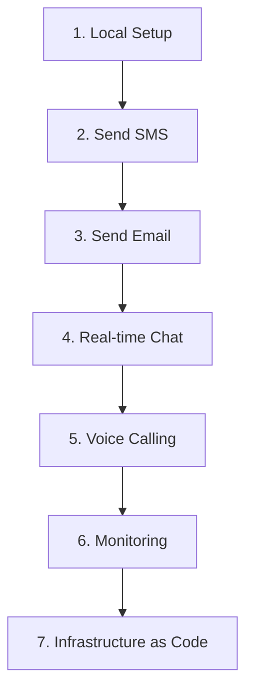

# Python SDK Tutorial

This tutorial provides a step-by-step guide to building communication features with Azure Communication Services (ACS).

## What You'll Build

By the end of this tutorial, you'll have a Python application capable of:
- Managing user identities and access tokens.
- Sending SMS and email notifications.
- Creating real-time chat threads.
- Implementing voice calling automation.
- Monitoring ACS operations.

## Prerequisites

- [Python 3.8+](https://www.python.org/)
- [An Azure Subscription](https://azure.microsoft.com/free/)
- [Visual Studio Code](https://code.visualstudio.com/) or another IDE.

## Tutorial Learning Path

The following path guides you through setting up and using ACS features.

<!-- diagram-id: python-tutorial-path -->

## Tutorial Steps

| Step | Topic | Description |
| --- | --- | --- |
| **01** | [Local Setup](./01-local-setup.md) | Install SDKs, configure environment variables, and verify with identity token creation. |
| **02** | [Send SMS](./02-send-sms.md) | Use the `SmsClient` to send messages and handle delivery reports. |
| **03** | [Send Email](./03-send-email.md) | Configure an `EmailClient` to send simple and HTML-formatted emails. |
| **04** | [Real-time Chat](./04-chat.md) | Build a chat system with threads, participants, and real-time messaging. |
| **05** | [Voice Calling](./05-voice-calling.md) | Automate outbound calls and handle basic call events. |
| **06** | [Monitoring](./06-logging-monitoring.md) | Configure logging and use KQL queries to monitor your ACS resource. |
| **07** | [Infrastructure as Code](./07-infrastructure-as-code.md) | Deploy ACS resources using Bicep templates and Python scripts. |

## See Also

- [Guide home](../../../index.md)
- [Start here](../../../start-here/overview.md)

## Sources
- [ACS Python SDK Documentation](https://learn.microsoft.com/en-us/python/api/overview/azure/communication?view=azure-python)
