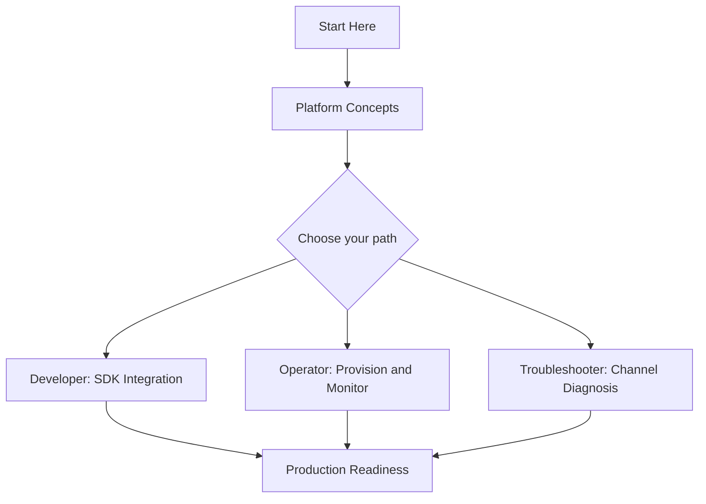
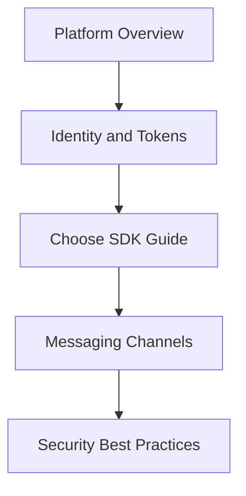
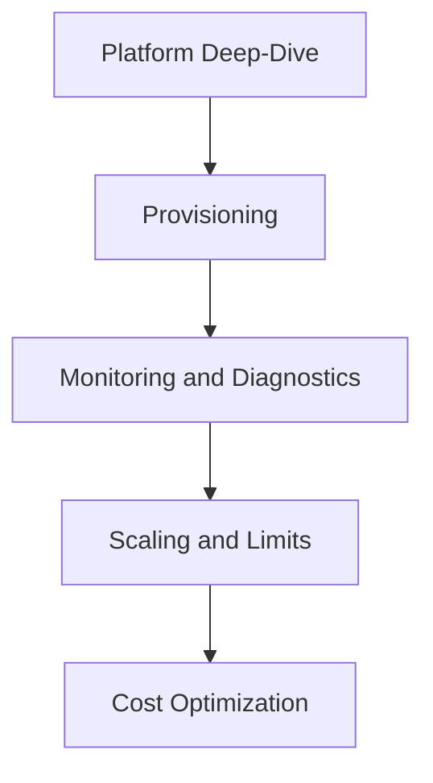
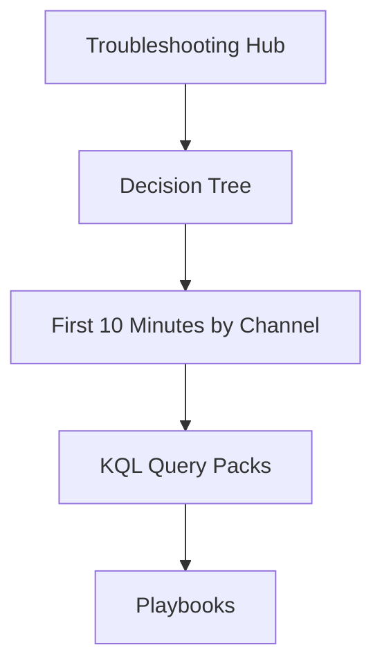

# Learning Paths

Use this page to choose a reading path based on your role and goal. Each path is numbered, so read the pages in order for the best result. Every path ends with a checklist of concrete outcomes you should be able to demonstrate.

!!! tip "Pick one primary path first"
    If you fit multiple roles, pick the one that matches your current goal, complete that path, then read a second path opportunistically. Trying to follow every path in parallel dilutes progress.

## Choose Your Path

| Role | Goal | Time Budget | Start With |
|---|---|---|---|
| **Developer** | Integrate calling, chat, SMS, or email into an app | 2-3 hours | [Overview](overview.md), [Platform Hub](../platform/index.md) |
| **Operator** | Provision and monitor ACS resources in production | 2-4 hours | [Platform Hub](../platform/index.md), [Operations Hub](../operations/index.md) |
| **Troubleshooter** | Diagnose calling quality, chat, SMS, and email delivery failures | 2-4 hours + on-call reference | [Troubleshooting Hub](../troubleshooting/index.md) |

## Recommended Sequence

<!-- diagram-id: acs-learning-paths-overview -->

## Developer Path

Integrate Azure Communication Services into an application. Focuses on identity tokens, SDK selection per channel (calling, chat, SMS, email), and secure implementation patterns.

**Time**: 2-3 hours

<!-- diagram-id: acs-learning-paths-developer -->

Read in order:

1. [Overview](overview.md)
2. [Platform Hub](../platform/index.md) — how ACS works, resource types, messaging channels
3. [Platform: Authentication](../platform/authentication.md) — identity, access tokens, and token lifetimes
4. Choose one SDK guide:
    - [.NET SDK Guide](../sdk-guides/dotnet/index.md)
    - [Java SDK Guide](../sdk-guides/java/index.md)
    - [JavaScript SDK Guide](../sdk-guides/javascript/index.md)
    - [Python SDK Guide](../sdk-guides/python/index.md)
5. [Platform: Messaging Channels](../platform/messaging-channels.md) — pick calling, chat, SMS, or email
6. [Best Practices: Security](../best-practices/security.md)

### Outcomes

- You can issue an ACS user identity and access token from a trusted server.
- You can send or receive on your chosen channel (calling, chat, SMS, or email) from client code.
- You can validate token expiry and refresh flows without leaking the connection string.
- You know which SDK surface belongs to your channel and where the recipes live.

### Microsoft Learn anchors

- [Azure Communication Services overview](https://learn.microsoft.com/en-us/azure/communication-services/overview)
- [Authentication in Azure Communication Services](https://learn.microsoft.com/en-us/azure/communication-services/concepts/authentication)
- [SDK options for Azure Communication Services](https://learn.microsoft.com/en-us/azure/communication-services/concepts/sdk-options)

## Operator Path

Provision and monitor ACS resources in production. Focuses on resource lifecycle, diagnostic logging, cost, and scale limits per channel.

**Time**: 2-4 hours

<!-- diagram-id: acs-learning-paths-operator -->

Read in order:

1. [Platform Hub](../platform/index.md) — how ACS works, resource types
2. Operations sequence:
    - [Operations Hub](../operations/index.md)
    - [Provisioning](../operations/provisioning.md)
    - [Email Provisioning](../operations/email-provisioning.md)
    - [Monitoring](../operations/monitoring.md)
    - [Health and Recovery](../operations/health-recovery.md)
    - [Security](../operations/security.md)
3. Best Practices sequence:
    - [Best Practices Hub](../best-practices/index.md)
    - [Production Baseline](../best-practices/production-baseline.md)
    - [Scaling](../best-practices/scaling.md)
    - [Reliability](../best-practices/reliability.md)
    - [Cost Optimization](../best-practices/cost-optimization.md)
4. Reference sequence:
    - [Platform Limits](../reference/platform-limits.md)
    - [SDK Reference](../reference/sdk-reference.md)

### Outcomes

- You can provision an ACS resource with the right domain and channel configuration.
- You can wire diagnostic logging to Log Analytics and validate the tables land.
- You can set service-health alerts and workload alerts for a critical channel.
- You can identify the top-cost channel and apply a scale or filtering change.

### Microsoft Learn anchors

- [Enable logs via Diagnostic Settings for ACS](https://learn.microsoft.com/en-us/azure/communication-services/concepts/analytics/diagnostic-logging)
- [ACS service limits](https://learn.microsoft.com/en-us/azure/communication-services/concepts/service-limits)
- [Manage Communication Services resources](https://learn.microsoft.com/en-us/azure/communication-services/quickstarts/create-communication-resource)

## Troubleshooter Path

Diagnose fast during a live incident. Focuses on channel-specific symptom mapping (calling quality, chat, SMS, email), diagnostic logs, and KQL.

**Time**: 2-4 hours + on-call reference

<!-- diagram-id: acs-learning-paths-troubleshooter -->

Read in order:

1. [Troubleshooting Hub](../troubleshooting/index.md)
2. [Troubleshooting Methodology](../troubleshooting/methodology/troubleshooting-method.md) and [Mental Model](../troubleshooting/mental-model.md)
3. [Decision Tree](../troubleshooting/decision-tree.md)
4. First 10 Minutes by channel:
    - [Calling Quality](../troubleshooting/first-10-minutes/calling-quality.md)
    - [Chat Connectivity](../troubleshooting/first-10-minutes/chat-connectivity.md)
    - [SMS Delivery](../troubleshooting/first-10-minutes/sms-delivery.md)
    - [Email Delivery](../troubleshooting/first-10-minutes/email-delivery.md)
5. [KQL Query Packs](../troubleshooting/kql/index.md)
6. [Playbooks Hub](../troubleshooting/playbooks/index.md)
7. [Reference: CLI Cheatsheet](../reference/cli-cheatsheet.md)

### Outcomes

- You can select the right First 10 Minutes runbook from a channel symptom description.
- You can write a KQL query against ACS diagnostic tables to isolate a failure window.
- You can pick the right playbook without guessing which channel owns the symptom.
- You can correlate ACS diagnostics with Azure Service Health to rule out platform events.

### Microsoft Learn anchors

- [Troubleshooting in Azure Communication Services](https://learn.microsoft.com/en-us/azure/communication-services/concepts/troubleshooting-info)
- [ACS logs data reference](https://learn.microsoft.com/en-us/azure/communication-services/concepts/analytics/logs/voice-and-video-logs)
- [Azure Service Health overview](https://learn.microsoft.com/en-us/azure/service-health/service-health-overview)

## Track Selection Matrix

| Situation | Start with | Then continue to |
|---|---|---|
| First integration into an app | Developer Path | Operator Path |
| Standing up an ACS resource for a workload | Operator Path | Developer Path |
| Preparing for launch | Operator Path | Troubleshooter Path |
| Active incident on a channel | Troubleshooter Path | Operator Path (hardening) |

!!! tip "Live incident? Skip the path."
    If you are actively responding to a page, jump straight to [Troubleshooting Hub](../troubleshooting/index.md), the [Decision Tree](../troubleshooting/decision-tree.md), and the First 10 Minutes runbook for your channel.

## See Also

- [Overview](overview.md)
- [Scenario Router](scenario-router.md)
- [Repository Map](repository-map.md)
- [Platform Hub](../platform/index.md)
- [SDK Guides Hub](../sdk-guides/index.md)
- [Best Practices Hub](../best-practices/index.md)
- [Operations Hub](../operations/index.md)
- [Troubleshooting Hub](../troubleshooting/index.md)

## Sources

- [Azure Communication Services overview](https://learn.microsoft.com/en-us/azure/communication-services/overview)
- [SDK options for Azure Communication Services](https://learn.microsoft.com/en-us/azure/communication-services/concepts/sdk-options)
- [Authentication in Azure Communication Services](https://learn.microsoft.com/en-us/azure/communication-services/concepts/authentication)
- [Enable logs via Diagnostic Settings for ACS](https://learn.microsoft.com/en-us/azure/communication-services/concepts/analytics/diagnostic-logging)
- [ACS service limits](https://learn.microsoft.com/en-us/azure/communication-services/concepts/service-limits)
