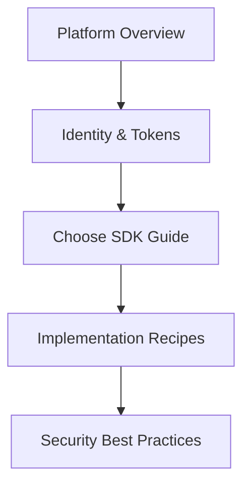
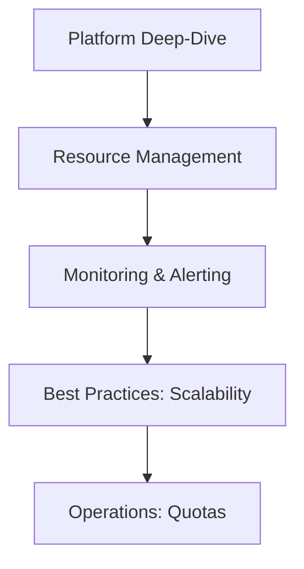
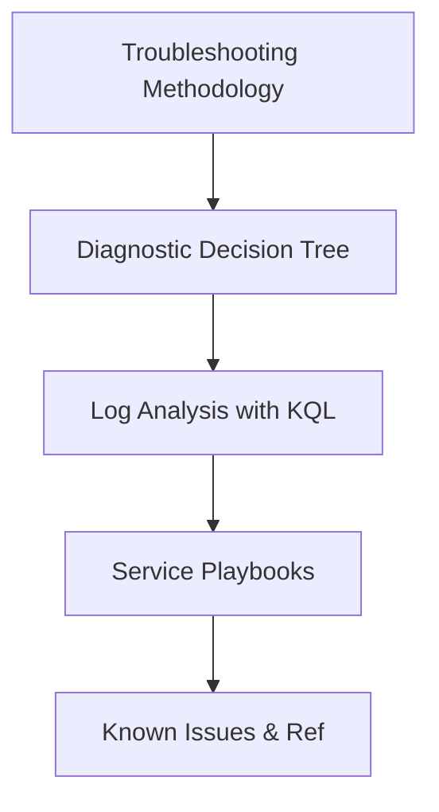

---
content_sources:
  diagrams:
    - id: dev-path
      type: Mermaid
      source: self-generated
    - id: ops-path
      type: Mermaid
      source: self-generated
    - id: trouble-path
      type: Mermaid
      source: self-generated
---

# Learning Paths

This guide is designed to be read in multiple ways depending on your current needs and role. Choose the path that best fits your objective.

## Path Selection

| Role | Goal | Recommended Starting Point |
| :--- | :--- | :--- |
| **Developer** | Build and integrate features | [Developer Path](#developer-path) |
| **Operator** | Manage and monitor at scale | [Operator Path](#operator-path) |
| **Troubleshooter** | Resolve production issues | [Troubleshooter Path](#troubleshooter-path) |

---

## Developer Path

The Developer path focuses on implementation details, SDK usage, and core platform concepts like Identity and Access Tokens.

<!-- diagram-id: dev-path -->

**Recommended Reading Order:**

1. [Platform: Core Concepts](../platform/index.md)
2. [Platform: Authentication](../platform/authentication.md)
3. [SDK Guides](../sdk-guides/index.md) (Choose your preferred language)
4. [Best Practices: Security](../best-practices/security.md)

---

## Operator Path

The Operator path is designed for SREs and DevOps professionals who manage the ACS resources and ensure service reliability.

<!-- diagram-id: ops-path -->

**Recommended Reading Order:**

1. [Platform: How ACS Works](../platform/how-acs-works.md)
2. [Operations: Monitoring](../operations/monitoring.md)
3. [Best Practices: Scaling](../best-practices/scaling.md)
4. [Reference: Platform Limits](../reference/platform-limits.md)

---

## Troubleshooter Path

The Troubleshooter path is for rapid response. It starts with diagnostic entry points and moves toward systematic playbooks.

<!-- diagram-id: trouble-path -->

**Recommended Reading Order:**

1. [Troubleshooting: Methodology](../troubleshooting/methodology/troubleshooting-method.md)
2. [Troubleshooting: KQL for ACS](../troubleshooting/kql/index.md)
3. [Troubleshooting: Playbooks](../troubleshooting/playbooks/index.md)
4. [Reference: CLI Cheatsheet](../reference/cli-cheatsheet.md)

---

## See Also

- [Guide Overview](overview.md)
- [Repository Map](repository-map.md)

## Sources

- [Azure Communication Services Developer Guide](https://learn.microsoft.com/azure/communication-services/concepts/sdk-options)
- [ACS Monitoring and Diagnostics](https://learn.microsoft.com/azure/communication-services/concepts/analytics/diagnostic-logging)
