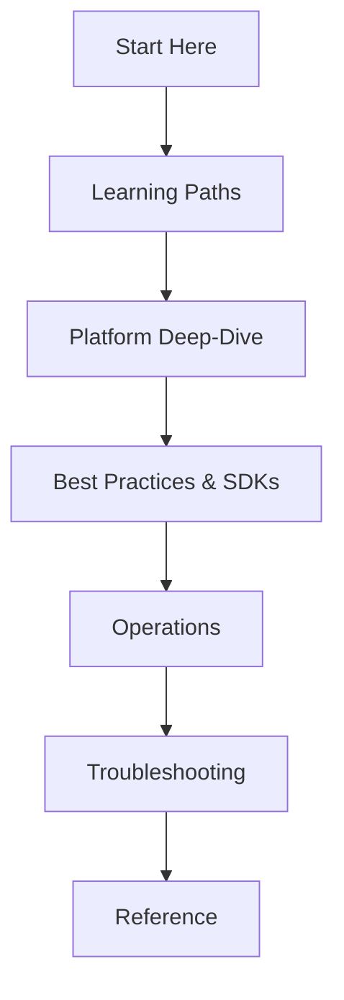

---
hide:
  - toc
content_sources:
  diagrams:
    - id: guide-navigation
      type: Mermaid
      source: self-generated
      justification: "https://learn.microsoft.com/azure/communication-services/overview"
      based_on: "https://learn.microsoft.com/azure/communication-services/overview"
---

# Azure Communication Services Practical Guide

This guide is a structured, hands-on repository of knowledge for building and managing communication capabilities with Azure. It is designed to bridge the gap between "getting started" and "running production."

## Guide Scope and Audience

This documentation is created for:

- **Developers**: Implementing SMS, Email, Chat, Voice, or Video calling in their applications.
- **SREs & DevOps Engineers**: Managing ACS resources, monitoring performance, and configuring alerts.
- **Support & Troubleshooting Engineers**: Diagnosing issues, analyzing logs, and solving real-world production failures.

## Guide Structure

The guide is organized into seven distinct sections, each serving a specific phase of the application lifecycle.

| Section | Content Focus | Target Goal |
| :--- | :--- | :--- |
| **Start Here** | Orientation and paths | Choose your learning journey |
| **Platform** | Core concepts and architecture | Understand how ACS works |
| **Best Practices** | Production-ready patterns | Build it right the first time |
| **SDK Guides** | Language-specific examples | Write efficient, clean code |
| **Operations** | Monitoring and management | Keep the system healthy |
| **Troubleshooting** | Diagnostics and playbooks | Fix issues rapidly |
| **Reference** | Limits and specifications | Quick access to details |

## Navigation

<!-- diagram-id: guide-navigation -->

## How to Use This Guide

1. **Pick a Role**: Start with the [Learning Paths](learning-paths.md) to find the most relevant reading order for your role.
2. **Understand the Core**: Spend time in the Platform section to understand Identity and Tokens before starting any implementation.
3. **Use the Recipes**: Browse the SDK Guides and Best Practices for reusable patterns.
4. **Debug with Playbooks**: When things go wrong, the Troubleshooting section provides step-by-step diagnostic paths.

## See Also

- [Repository Map](repository-map.md)
- [About the Project](../about.md)

## Sources

- [Azure Communication Services Official Documentation](https://learn.microsoft.com/azure/communication-services/)
- [ACS Service Concepts](https://learn.microsoft.com/azure/communication-services/concepts/client-and-server-architecture)
