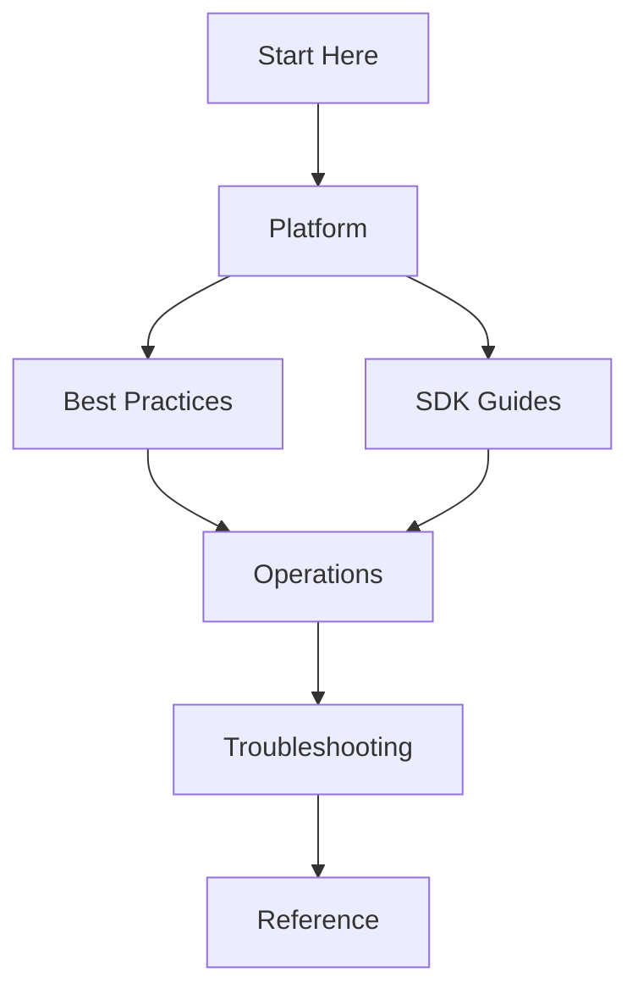

---
content_sources:
  diagrams:
    - id: section-relationships
      type: flowchart
      source: self-generated
      justification: Original diagram illustrating how the guide's sections relate to each other in the reader journey.
---

# Repository Map

The Azure Communication Services Practical Guide is structured to provide a clear separation of concerns between architecture, implementation, and operations.

## Repository Layout

```text
azure-communication-services-practical-guide/
├── docs/
│   ├── index.md                # Home page
│   ├── about.md                # About this project
│   ├── start-here/             # Orientation and paths
│   │   ├── overview.md         # Guide scope and structure
│   │   ├── learning-paths.md   # Role-based guides
│   │   └── repository-map.md   # [You are here] Directory structure
│   ├── platform/               # Core ACS architecture
│   │   ├── identity-tokens.md  # Identity management
│   │   └── resource-mgmt.md    # Resource provisioning
│   ├── best-practices/         # Production-ready patterns
│   │   ├── security.md         # Authentication and authorization
│   │   └── scalability.md      # Scaling SMS/Calling
│   ├── sdk-guides/             # Language-specific implementation
│   │   ├── python/             # Python SDK recipes
│   │   └── javascript/         # JS/TS SDK recipes
│   ├── operations/             # Managing ACS at scale
│   │   ├── monitoring.md       # Logs and metrics
│   │   └── quotas.md           # Limits and usage
│   ├── troubleshooting/        # Diagnostic playbooks
│   │   ├── methodology.md      # Systematic approach
│   │   └── kql.md              # KQL queries for ACS
│   └── reference/              # Technical specifications
│       ├── error-codes.md      # Common failure codes
│       └── service-specs.md    # API limits
└── mkdocs.yml                  # MkDocs configuration
```

## Section Responsibilities

- **Start Here**: Provides the entry point for all users, including the scope of the guide and how to navigate it.
- **Platform**: Describes the fundamental building blocks of ACS (e.g., Identity, Resource Management).
- **Best Practices**: Offers curated advice for moving from development to production.
- **SDK Guides**: Contains code-heavy examples and implementation patterns for specific languages.
- **Operations**: Focuses on long-term maintainability, observability, and scale.
- **Troubleshooting**: Provides the tactical tools and methods for resolving incidents.
- **Reference**: Acts as a quick lookup for technical details, limits, and specifications.

## Section Relationships

<!-- diagram-id: section-relationships -->


## Navigation Guidance

1. **Relative Paths**: Always use relative paths when linking between documents (e.g., `../platform/index.md`).
2. **Standard Headers**: Each section should start with a clear Title and Intro.
3. **Consistent Front Matter**: All files must include the standard front matter block.

## See Also

- [Guide Overview](overview.md)
- [Learning Paths](learning-paths.md)
- [Scenario Router](scenario-router.md)

## Sources

- [ACS Documentation Repository Structure](https://github.com/MicrosoftDocs/azure-docs/tree/main/articles/communication-services)
