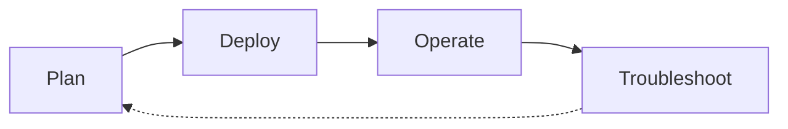

# Scenario Router

Use this page when you have a specific situation and want to jump straight to the page that answers it. This is a breadth-first index across four lifecycle phases — Plan, Deploy, Operate, Troubleshoot — that complements the depth-first [Learning Paths](learning-paths.md) and the symptom-first [Decision Tree](../troubleshooting/decision-tree.md).

!!! tip "Start with Learning Paths if you're new to ACS"
    This page assumes you already know what you're trying to do. If you're still deciding what to learn first, start with [Learning Paths](learning-paths.md) — it sequences a role-based tour of the guide. Use this Scenario Router when you have a specific question and want to jump to the exact page that answers it.

## How to Use This Router

- Pick the table for the lifecycle phase you're in — Plan, Deploy, Operate, or Troubleshoot.
- Scan the left column for the situation that matches yours; open the destination on the right.
- If two rows fit, prefer the row from the phase you're actually in — the same platform concept often appears in more than one phase.
- If your situation spans two phases (a channel design choice today that will become a delivery incident later), check [Cross-Phase Scenarios](#cross-phase-scenarios) first.
- Rows are frequently channel-specific — SMS, Email, Voice/Video, Chat, and Teams Interop behave differently and need different destinations.
- Every destination is a real page in this guide, not an external link and not an aspirational page.
- Rows are intentionally short. Follow the link for the depth; this table is a switchboard, not a summary.
- If your situation is missing, [open an issue](https://github.com/yeongseon/azure-communication-services-practical-guide/issues) — the router is meant to grow.

## Lifecycle Overview

<!-- diagram-id: acs-scenario-router-lifecycle -->

## I'm Planning

| Situation | Where to go |
|---|---|
| I'm choosing which learning path to follow | [Learning Paths](learning-paths.md) — role-based reading paths |
| I want to understand how ACS works end-to-end | [How ACS Works](../platform/how-acs-works.md) — platform architecture |
| I'm choosing between SMS, Email, Voice/Video, Chat, or Teams Interop | [Messaging Channels](../platform/messaging-channels.md) — channel selection and fit |
| I'm designing the ACS resource model and connection strings | [Resource Types](../platform/resource-types.md) — resource lifecycle |
| I'm designing identity, tokens, and access | [Platform Authentication](../platform/authentication.md) — user tokens and expiry |
| I'm designing network topology and egress | [Platform Networking](../platform/networking.md) — inbound and outbound topology |
| I'm designing end-to-end security architecture | [Security Architecture](../platform/security-architecture.md) — trust boundaries and controls |
| I'm designing the production baseline (limits, SLA, security) | [Production Baseline](../best-practices/production-baseline.md) — hardening checklist |
| I want to avoid common ACS anti-patterns | [Common Anti-Patterns](../best-practices/common-anti-patterns.md) — what to not do and why |

## I'm Deploying

| Situation | Where to go |
|---|---|
| I want the quickest possible first integration | [SDK Guides Hub](../sdk-guides/index.md) — pick Python, JavaScript, Java, or .NET |
| I'm provisioning a new ACS resource | [Provisioning](../operations/provisioning.md) — CLI and portal flows |
| I'm setting up an Email Communication Service and domain | [Email Provisioning](../operations/email-provisioning.md) — domain verification and sender configuration |
| I'm wiring Event Grid webhooks (SMS delivery reports, incoming call events) | [Event Handling](../platform/event-handling.md) — Event Grid integration |
| I'm choosing a deployment strategy | [Deployment Hub](../operations/deployment/index.md) — CI/CD and IaC options |
| I'm authoring Bicep or Terraform for ACS | [Bicep / Terraform](../operations/deployment/bicep-terraform.md) — IaC templates |
| I'm wiring GitHub Actions CI/CD | [GitHub Actions Deployment](../operations/deployment/github-actions.md) — federated identity and pipeline templates |

## I'm Operating in Production

| Situation | Where to go |
|---|---|
| I need day-2 operational procedures | [Operations Hub](../operations/index.md) — production runbooks |
| I want to follow production best practices | [Best Practices Hub](../best-practices/index.md) — hardening and design guidance |
| I need to wire diagnostic logs, metrics, and alerts | [Operations: Monitoring](../operations/monitoring.md) — logs, metrics, and alerts |
| I need to plan for health checks and failure recovery | [Health and Recovery](../operations/health-recovery.md) — recovery patterns per channel |
| I'm hardening operational security | [Operations: Security](../operations/security.md) — identity, secrets, and network |
| I need to control cost across a portfolio | [Cost Optimization](../operations/cost-optimization.md) — cost drivers per channel |
| I'm planning scale for a channel (SMS throughput, calling concurrency) | [Scaling Best Practices](../best-practices/scaling.md) — per-channel scale patterns |
| I need to design for reliability (retry, backoff, DLQ) | [Reliability Best Practices](../best-practices/reliability.md) — reliability patterns |
| I'm applying networking best practices (private links, TLS) | [Networking Best Practices](../best-practices/networking.md) — network hardening |

## I'm Troubleshooting

| Situation | Where to go |
|---|---|
| I need to systematically diagnose an issue | [Decision Tree](../troubleshooting/decision-tree.md) — hypothesis-driven triage flow |
| I need to know what evidence to collect | [Evidence Map](../troubleshooting/evidence-map.md) — question → KQL + CLI artifact index |
| I need the mental model of how a failure propagates | [Mental Model](../troubleshooting/mental-model.md) — request path and failure boundaries |
| I need a first-principles method for a novel symptom | [Troubleshooting Method](../troubleshooting/methodology/troubleshooting-method.md) — competing hypotheses framework |
| An incident just started and I have 10 minutes | [First 10 Minutes Hub](../troubleshooting/first-10-minutes/index.md) — ordered triage checklists |
| Email is not being delivered | [First 10 Minutes: Email Delivery](../troubleshooting/first-10-minutes/email-delivery.md) — sender, domain, and spam checks |
| SMS is not being delivered | [First 10 Minutes: SMS Delivery](../troubleshooting/first-10-minutes/sms-delivery.md) — number, carrier, and opt-out checks |
| Calling audio or video quality is degraded | [First 10 Minutes: Calling Quality](../troubleshooting/first-10-minutes/calling-quality.md) — network, media, and codec checks |
| Chat clients cannot connect or send messages | [First 10 Minutes: Chat Connectivity](../troubleshooting/first-10-minutes/chat-connectivity.md) — token, endpoint, and delivery checks |
| I need channel-specific KQL queries | [KQL Query Packs Hub](../troubleshooting/kql/index.md) — per-channel diagnostic queries |

## Cross-Phase Scenarios

Some situations straddle two phases — the channel design choice you make while planning determines the delivery failure you eventually debug. These rows link the two together so you can see the pattern *and* the drill in one place. If you're only in one phase today, still skim this table: it's the cheapest way to preview which channel decisions will hurt later.

| Situation | Where to go |
|---|---|
| I'm designing an email sender and want to preview the domain-verification failure mode | [Email Provisioning](../operations/email-provisioning.md) then [Email Domain Verification](../troubleshooting/playbooks/email/domain-verification.md) — plan + drill |
| I'm planning SMS throughput and want to see the rate-limit failure mode | [Scaling Best Practices](../best-practices/scaling.md) then [SMS Rate Limiting](../troubleshooting/playbooks/sms/rate-limiting.md) — plan + incident |
| I'm designing voice quality baselines and want to see the quality-degradation failure mode | [Reliability Best Practices](../best-practices/reliability.md) then [Voice/Video Call Quality](../troubleshooting/playbooks/voice-video/call-quality.md) — plan + drill |
| I'm designing chat notifications and want to see the notification-delivery failure mode | [Messaging Channels](../platform/messaging-channels.md) then [Chat Real-Time Notifications](../troubleshooting/playbooks/chat/real-time-notifications.md) — plan + incident |

## When This Router Isn't the Right Entry Point

- You're brand new to ACS → start with [Learning Paths](learning-paths.md) instead.
- You already have a symptom (email not delivered, SMS blocked, call dropped, chat disconnected) and don't know which lifecycle phase you're in → jump to [Decision Tree](../troubleshooting/decision-tree.md) or the channel-specific [First 10 Minutes](../troubleshooting/first-10-minutes/index.md) runbook.
- You're picking an SDK for a brand-new app → use [SDK Guides Hub](../sdk-guides/index.md).

## See Also

- [Learning Paths](learning-paths.md) — depth-first, role-based reading order
- [Overview](overview.md) — what ACS is and who this guide is for
- [Repository Map](repository-map.md) — full section map
- [SDK Guides Hub](../sdk-guides/index.md) — Python, JavaScript, Java, .NET
- [Decision Tree](../troubleshooting/decision-tree.md) — symptom-first troubleshooting router
- [Evidence Map](../troubleshooting/evidence-map.md) — evidence-collection index
