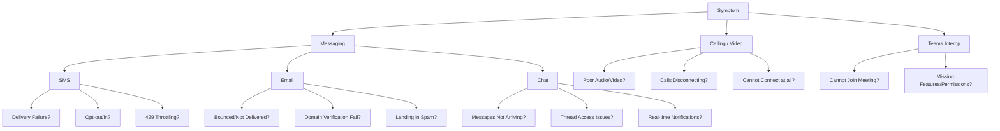
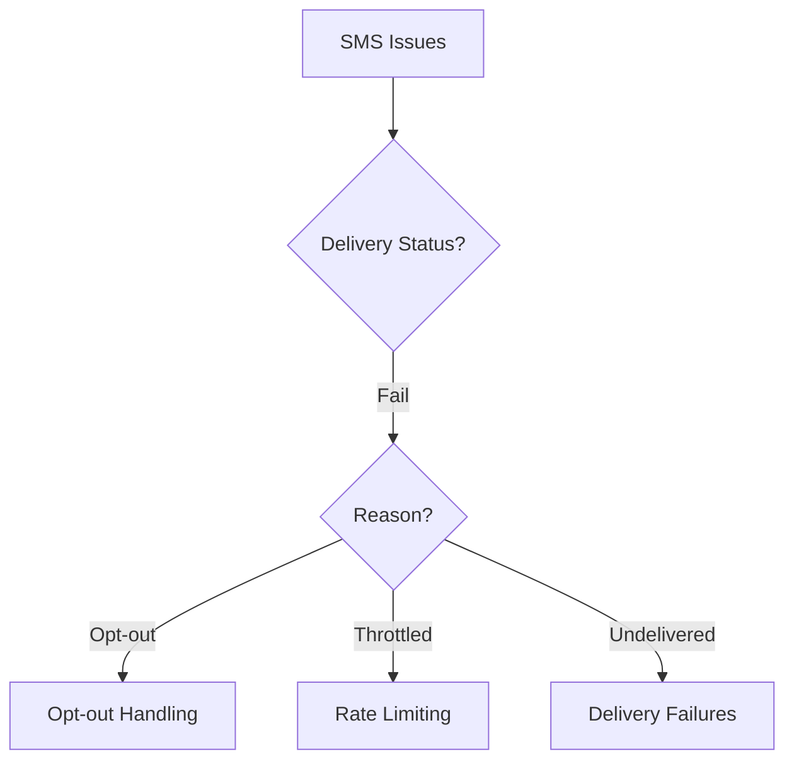
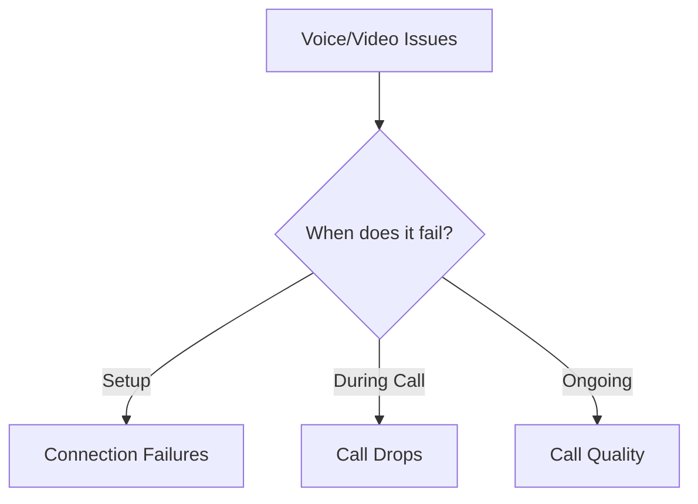

---
content_sources:
  diagrams:
    - id: main-decision-tree
      type: flowchart
      source: self-generated
      justification: Original symptom-routing decision tree that directs ACS communication issues to the appropriate specialized playbook.
    - id: sms-sub-tree
      type: flowchart
      source: self-generated
      justification: Original decision sub-tree for SMS delivery and provisioning failures.
    - id: calling-sub-tree
      type: flowchart
      source: self-generated
      justification: Original decision sub-tree for Calling and Video quality and connection failures.
---

# Troubleshooting Decision Tree

This comprehensive guide helps you route symptoms to the appropriate troubleshooting playbook.

## Symptom Routing

<!-- diagram-id: main-decision-tree -->

## SMS Routing Sub-tree

<!-- diagram-id: sms-sub-tree -->

## Calling Routing Sub-tree

<!-- diagram-id: calling-sub-tree -->

## See Also
* [Top-level Troubleshooting Overview](index.md)
* [Evidence Map](evidence-map.md)

## Sources
* Azure Communication Services Documentation
* Troubleshooting Support Framework
