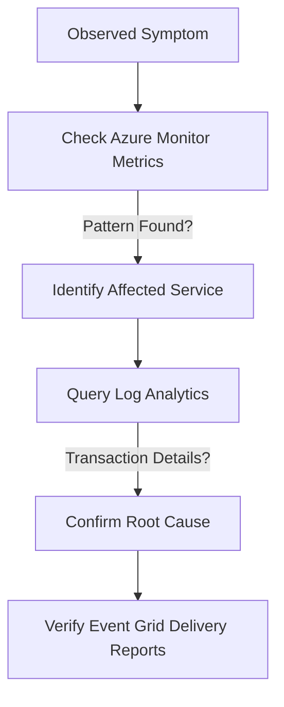

---
content_sources:
  - azure-monitor
  - acs-diagnostics
---

# Evidence Map

This guide maps failure types to the specific metrics, logs, and configurations needed for effective troubleshooting.

## Evidence Collection by Failure Type

| Failure Type | Metrics | Log Analytics Tables | Event Grid Events |
| --- | --- | --- | --- |
| **SMS Delivery** | `SMS API Requests` | `ACSSMSIncomingOperations` | `Microsoft.Communication.SMSReceived`, `Microsoft.Communication.SMSDeliveryReportReceived` |
| **Email Delivery** | `Email Service API Requests`, `Email Service Delivery Status Updates`, `Email Service User Engagement` | `ACSEmailSendMailOperational`, `ACSEmailStatusUpdateOperational`, `ACSEmailUserEngagementOperational` | `Microsoft.Communication.EmailDeliveryReportReceived` |
| **Chat Latency** | `ChatMessageReceived`, `ChatMessageSent` | `ACSChatMessageReceivedEvents`, `ACSChatMessageSentEvents` | `Microsoft.Communication.ChatMessageReceived` |
| **Call Quality** | `CallMediaStreamQuality`, `CallMediaSetup` | `ACSCallSummaryEvents`, `ACSCallDiagnosticsEvents` | `Microsoft.Communication.CallStarted`, `Microsoft.Communication.CallEnded` |
| **Teams Interop** | `TeamsInteroperabilityEvents` | `ACSTeamsInteroperabilityEvents` | `Microsoft.Communication.TeamsMeetingParticipantAdded` |

## Evidence Types

### 1. Azure Monitor Metrics
Provide real-time visibility into service health, error rates, and throughput. Essential for alerting.

### 2. Log Analytics
Provide granular transaction-level details, error codes, and request/response metadata. Best for retrospective root cause analysis.

### 3. ACS Client Diagnostics
Client-side logs and [User Facing Diagnostics (UFD)](https://learn.microsoft.com/en-us/azure/communication-services/concepts/voice-video-calling/user-facing-diagnostics) provide insights into network conditions and device issues.

### 4. Event Grid
Real-time webhooks for delivery reports, message events, and state changes.

## Evidence Flow

<!-- diagram-id: evidence-collection-flow -->

## See Also
* [Methodology: Detector Map](methodology/detector-map.md)
* [KQL Query Library Overview](kql/index.md)

## Sources
* [ACS Diagnostic Logs Documentation](https://learn.microsoft.com/en-us/azure/communication-services/concepts/analytics/diagnostic-logging)
* Azure SDK Network Logging Guide
