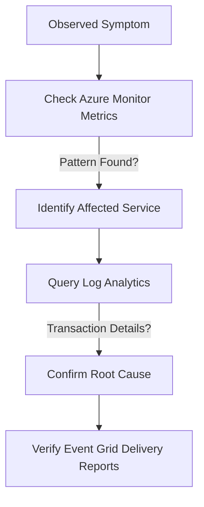

---
content_sources:
  - https://learn.microsoft.com/azure/communication-services/concepts/metrics
  - https://learn.microsoft.com/en-us/azure/azure-monitor/reference/microsoft-communication-communicationservices
  - https://learn.microsoft.com/en-us/azure/azure-monitor/reference/acsemailstatusupdateoperational
  - https://learn.microsoft.com/en-us/azure/azure-monitor/reference/acscalldiagnostics
content_validation:
  status: pending_review
  last_reviewed: null
  reviewer: agent
  core_claims: []
---

# Evidence Map

This guide maps failure types to the specific metrics, logs, and configurations needed for effective troubleshooting.

## Evidence Collection by Failure Type

| Failure Type | Azure Monitor Metric Signal | Log Analytics Tables | Event Grid Events |
| --- | --- | --- | --- |
| **SMS Delivery** | ACS API request metrics filtered by SMS `Operation`, `Status Code`, and `StatusSubClass` | `ACSSMSIncomingOperations` | `Microsoft.Communication.SMSReceived`, `Microsoft.Communication.SMSDeliveryReportReceived` |
| **Email Delivery** | ACS API request metrics filtered by email send/status operations and status dimensions | `ACSEmailSendMailOperational`, `ACSEmailStatusUpdateOperational` | Email delivery report events when Event Grid is configured |
| **Chat Latency** | ACS API request metrics filtered by chat operations plus `DurationMs` from logs | `ACSChatIncomingOperations` | `Microsoft.Communication.ChatMessageReceived` |
| **Call Quality** | Derived from call diagnostic logs, not from a documented `CallQuality` metric name | `ACSCallSummary`, `ACSCallDiagnostics`, `ACSCallClientMediaStatsTimeSeries` | Call events when Event Grid is configured for the scenario |
| **Teams Interop** | ACS API request metrics filtered to Teams interop-related operations where applicable | `ACSCallSummary`, `ACSCallDiagnostics` | Teams interop events where configured |

## Evidence Types

### 1. Azure Monitor Metrics
Provide near-real-time visibility into ACS API request volume and status. Use documented dimensions rather than invented channel delivery-rate metric names.

### 2. Log Analytics
Provide granular transaction-level details, error codes, and request/response metadata. Best for retrospective root cause analysis.

### 3. ACS Client Diagnostics
Client-side logs and [User Facing Diagnostics (UFD)](https://learn.microsoft.com/en-us/azure/communication-services/concepts/voice-video-calling/user-facing-diagnostics) provide insights into network conditions and device issues.

### 4. Event Grid
Real-time webhooks for delivery reports, message events, and state changes.

## Evidence Flow

<!-- diagram-id: evidence-collection-flow -->

## See Also
* [Methodology: Detector Map](methodology/detector-map.md)
* [KQL Query Library Overview](kql/index.md)

## Sources
* [Enable logging with Azure Monitor](https://learn.microsoft.com/azure/communication-services/concepts/analytics/enable-logging)
* [ACS Log Analytics tables](https://learn.microsoft.com/en-us/azure/azure-monitor/reference/microsoft-communication-communicationservices)
