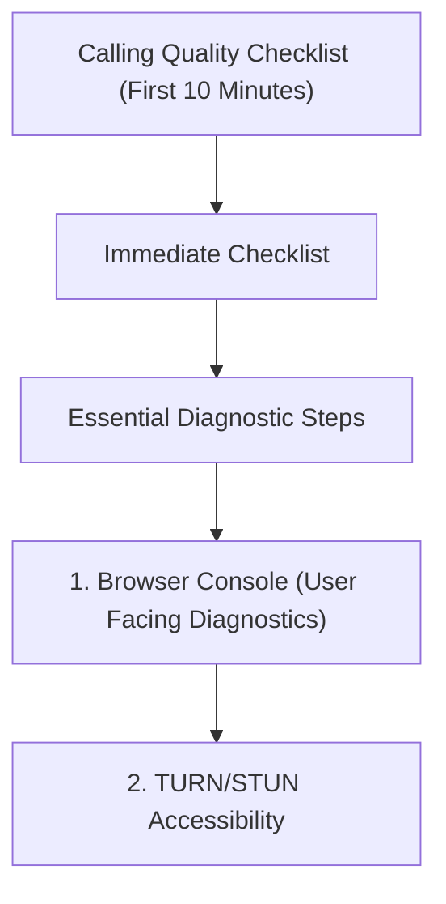

---
content_sources:
  sources:
  - type: mslearn-adapted
    url: https://learn.microsoft.com/azure/communication-services/concepts/voice-video-calling/user-facing-diagnostics
  - type: mslearn-adapted
    url: https://learn.microsoft.com/azure/communication-services/concepts/analytics/logs/voice-and-video-logs
  - type: mslearn-adapted
    url: https://learn.microsoft.com/en-us/azure/azure-monitor/reference/acscalldiagnostics
  diagrams:
  - id: calling-quality-page-flow
    type: flowchart
    source: self-generated
    justification: Synthesized from the page structure and Microsoft Learn sources
      listed in this document.
    based_on:
    - https://learn.microsoft.com/azure/communication-services/concepts/voice-video-calling/user-facing-diagnostics
content_validation:
  status: pending_review
  last_reviewed: null
  reviewer: agent
  core_claims: []
---
# Calling Quality Checklist (First 10 Minutes)

When audio or video quality suffers or calls drop, follow this initial checklist.

## Immediate Checklist

1. **Network Connectivity**: Is the client on a stable Wi-Fi or cellular network?
2. **Firewall Access (TURN/STUN)**: Are the required UDP/TCP ports open for media?
3. **Available Bandwidth**: Is there sufficient bandwidth for the selected video resolution?
4. **Codec Support**: Is the browser or device using a supported codec (e.g., H.264, VP8)?
5. **Local Device Health**: Are CPU or memory levels extremely high on the client device?

## Essential Diagnostic Steps

### 1. Browser Console (User Facing Diagnostics)
Enable User Facing Diagnostics (UFD) in your app to capture network issues.

```javascript
const call = callAgent.startCall([{ communicationUserId: 'recipient-id' }]);
call.feature(Features.UserFacingDiagnostics).network.on('diagnosticChanged', (diagnosticInfo) => {
    console.log(`Diagnostic: ${diagnosticInfo.diagnostic}, value: ${diagnosticInfo.value}`);
});
```

### 2. TURN/STUN Accessibility
Verify the client can reach Azure media services. Use a network test tool if available.

### 3. Check Media Stream Quality
Review the logs for `bad-network` or `no-network` signals from the SDK.

## Key KQL Queries

Run this to see call setup and media quality issues:

```kusto
ACSCallDiagnostics
| where TimeGenerated > ago(1h)
| summarize
    AvgRoundTripTimeMs = avg(RoundTripTimeAvg),
    AvgJitterMs = avg(JitterAvg),
    AvgPacketLoss = avg(PacketLossRateAvg),
    Samples = count()
    by Identifier, CodecName, MediaType, StreamDirection
| order by AvgPacketLoss desc
```

## Page Flow

<!-- diagram-id: calling-quality-page-flow -->


## Review Matrix

| Review area | Page-specific check |
|---|---|
| Scope | Confirm the guidance applies to Calling Quality Checklist (First 10 Minutes). |
| Source basis | Validate the recommendation against the Microsoft Learn sources in this page. |
| Evidence | Capture command output, portal state, metrics, logs, or screenshots before treating the result as proven. |

## See Also
* [Call Quality Playbook](../playbooks/voice-video/call-quality.md)
* [Call Drops Playbook](../playbooks/voice-video/call-drops.md)

## Sources
* [User Facing Diagnostics](https://learn.microsoft.com/azure/communication-services/concepts/voice-video-calling/user-facing-diagnostics)
* [Voice and video call logs](https://learn.microsoft.com/azure/communication-services/concepts/analytics/logs/voice-and-video-logs)
* [ACSCallDiagnostics table](https://learn.microsoft.com/en-us/azure/azure-monitor/reference/acscalldiagnostics)
