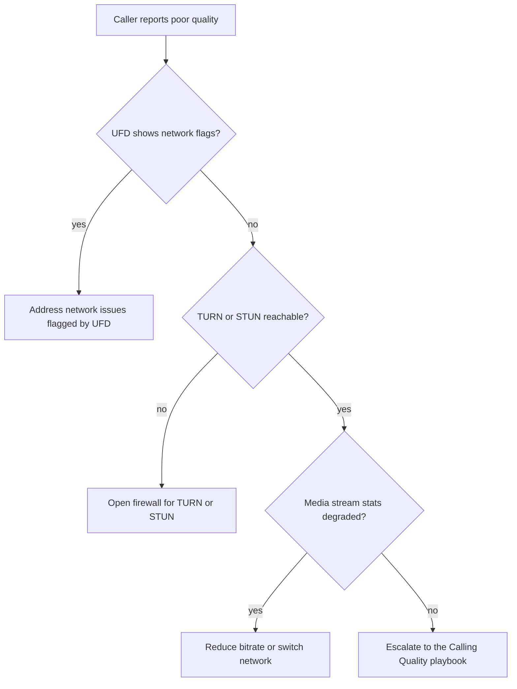

---
content_sources:
  diagrams:
    - id: f10m-calling-quality-flow
      type: flowchart
      source: mslearn-adapted
      based_on:
        - https://learn.microsoft.com/en-us/azure/communication-services/concepts/voice-video-calling/user-facing-diagnostics

content_validation:
  status: verified
  last_reviewed: 2026-07-25
  reviewer: agent
  core_claims:
    - claim: "The ACS calling SDK surfaces User Facing Diagnostics events that help identify network, device, browser, and microphone or camera issues during call triage"
      source: https://learn.microsoft.com/en-us/azure/communication-services/concepts/voice-video-calling/user-facing-diagnostics
      verified: true
    - claim: "Voice and video diagnostics are also available through Azure Monitor logs, so first-10-minute call investigations can correlate client symptoms with backend call data"
      source: https://learn.microsoft.com/en-us/azure/communication-services/concepts/analytics/logs/voice-and-video-logs
      verified: true
---

# Calling Quality Checklist (First 10 Minutes)

When audio or video quality suffers or calls drop, follow this initial checklist.

## Immediate Checklist

1. **Network Connectivity**: Is the client on a stable Wi-Fi or cellular network?
2. **Firewall Access (TURN/STUN)**: Are the required UDP/TCP ports open for media?
3. **Available Bandwidth**: Is there sufficient bandwidth for the selected video resolution?
4. **Codec Support**: Is the browser or device using a supported codec (e.g., H.264, VP8)?
5. **Local Device Health**: Are CPU or memory levels extremely high on the client device?

## Essential Diagnostic Steps

<!-- diagram-id: f10m-calling-quality-flow -->

```mermaid
flowchart TD
    S["Caller reports poor quality"] --> C1{"UFD shows network flags?"}
    C1 -- yes --> A1["Address network issues flagged by UFD"]
    C1 -- no --> C2{"TURN or STUN reachable?"}
    C2 -- no --> A2["Open firewall for TURN or STUN"]
    C2 -- yes --> C3{"Media stream stats degraded?"}
    C3 -- yes --> A3["Reduce bitrate or switch network"]
    C3 -- no --> ESC["Escalate to the Calling Quality playbook"]
```

### 1. Browser Console (User Facing Diagnostics)
Enable User Facing Diagnostics (UFD) in your app to capture network issues.

```javascript
const call = callAgent.startCall([{ communicationUserId: 'recipient-id' }]);
call.feature(Features.UserFacingDiagnostics).network.on('diagnosticChanged', (diagnosticInfo) => {
    console.log(`Diagnostic: ${diagnosticInfo.diagnostic}, value: ${diagnosticInfo.value}`);
});
```

### 2. TURN/STUN Accessibility
Verify the client can reach Azure media services. Use a network test tool if available.

### 3. Check Media Stream Quality
Review the logs for `bad-network` or `no-network` signals from the SDK.

## Key KQL Queries

Run this to see call setup and media quality issues:

```kusto
ACSCallDiagnosticsEvents
| where TimeGenerated > ago(1h)
| where MediaPathQuality != "Good"
| summarize Count=count() by MediaPathQuality, CodecName, CallId
| order by Count desc
```

## See Also
* [Call Quality Playbook](../playbooks/voice-video/call-quality.md)
* [Call Drops Playbook](../playbooks/voice-video/call-drops.md)

## Sources
* [ACS Calling SDK Troubleshooting Documentation](https://learn.microsoft.com/en-us/azure/communication-services/concepts/voice-video-calling/user-facing-diagnostics)
* Microsoft Teams Media Optimization Guide
