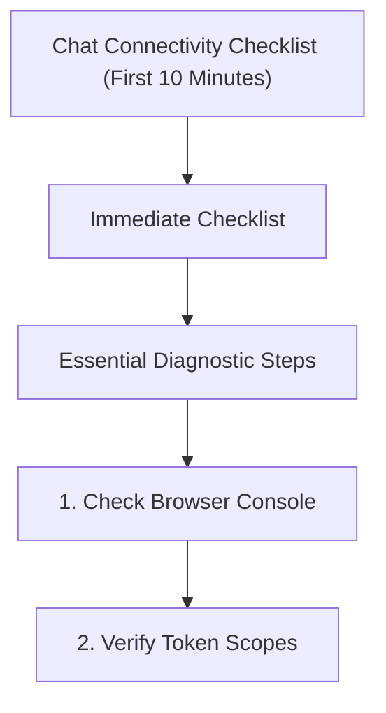

---
content_sources:
  sources:
  - type: mslearn-adapted
    url: https://learn.microsoft.com/azure/communication-services/concepts/metrics
  - type: mslearn-adapted
    url: https://learn.microsoft.com/azure/communication-services/concepts/analytics/logs/chat-logs
  - type: mslearn-adapted
    url: https://learn.microsoft.com/en-us/azure/azure-monitor/reference/acschatincomingoperations
  diagrams:
  - id: chat-connectivity-page-flow
    type: flowchart
    source: self-generated
    justification: Synthesized from the page structure and Microsoft Learn sources
      listed in this document.
    based_on:
    - https://learn.microsoft.com/azure/communication-services/concepts/metrics
content_validation:
  status: pending_review
  last_reviewed: null
  reviewer: agent
  core_claims: []
---
# Chat Connectivity Checklist (First 10 Minutes)

When chat messages are delayed or connectivity fails, follow this initial checklist.

## Immediate Checklist

1. **Access Token Validity**: Has the user's token expired? (Typically lasts 24h)
2. **Thread Existence**: Does the chat thread still exist and is the user a participant?
3. **Participant Permissions**: Does the user have the required role (e.g., `member`) to send messages?
4. **Network Connectivity**: Is the client's WebSocket connection blocked by a firewall?
5. **Real-time Event Subscription**: Is the app listening for incoming messages correctly?

## Essential Diagnostic Steps

### 1. Check Browser Console
Open the developer tools and look for `401 Unauthorized` or `403 Forbidden` errors.

### 2. Verify Token Scopes
Ensure the token has the `chat` scope when it was generated.

```bash
# Verify identity and existing tokens (if using identity service)
az communication identity list-tokens --user-id "<user_id>" --connection-string "<your_connection_string>"
```

### 3. Check Network Traffic
Look for failed requests to `*.communication.azure.com`. If WebSockets are blocked, chat will fail.

## Key KQL Queries

Run this to see chat message failures:

```kusto
ACSChatIncomingOperations
| where TimeGenerated > ago(1h)
| where ResultType == "Failed"
| summarize Count=count() by ResultSignature, ResultDescription, OperationName, ChatThreadId
| order by Count desc
```

## Page Flow

<!-- diagram-id: chat-connectivity-page-flow -->


## Review Matrix

| Review area | Page-specific check |
|---|---|
| Scope | Confirm the guidance applies to Chat Connectivity Checklist (First 10 Minutes). |
| Source basis | Validate the recommendation against the Microsoft Learn sources in this page. |
| Evidence | Capture command output, portal state, metrics, logs, or screenshots before treating the result as proven. |

## See Also
* [Chat Message Delivery Playbook](../playbooks/chat/message-delivery.md)
* [Real-time Notifications Playbook](../playbooks/chat/real-time-notifications.md)

## Sources
* [ACS metrics](https://learn.microsoft.com/azure/communication-services/concepts/metrics)
* [Chat logs](https://learn.microsoft.com/azure/communication-services/concepts/analytics/logs/chat-logs)
* [ACSChatIncomingOperations table](https://learn.microsoft.com/en-us/azure/azure-monitor/reference/acschatincomingoperations)
