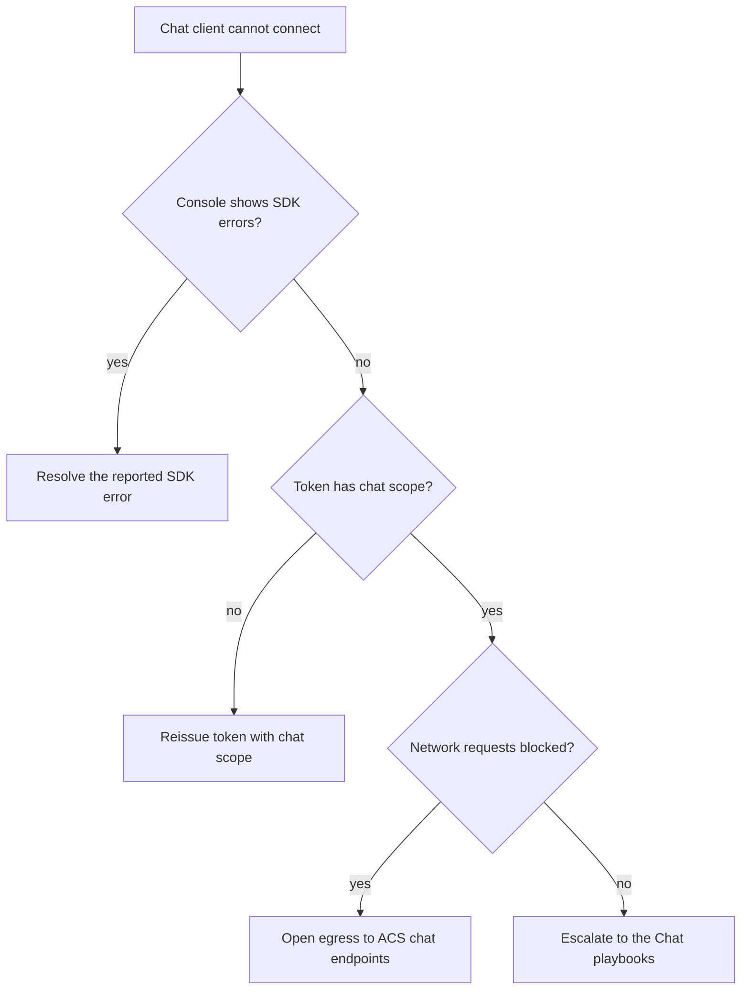

---
content_sources:
  diagrams:
    - id: f10m-chat-connectivity-flow
      type: flowchart
      source: self-generated
      justification: Visualizes this playbook's hypothesis triage and evidence-collection sequence, synthesized from the playbook content below.
content_validation:
  status: verified
  last_reviewed: 2026-07-25
  reviewer: agent
  core_claims:
    - claim: "ACS chat clients authenticate with Communication Identity access tokens rather than the raw Communication Services resource key"
      source: https://learn.microsoft.com/en-us/azure/communication-services/concepts/identity-model
      verified: true
    - claim: "ACS chat is designed for real-time messaging features such as message delivery, read receipts, and typing notifications, so chat connectivity triage must include the real-time channel path"
      source: https://learn.microsoft.com/en-us/azure/communication-services/concepts/chat/concepts
      verified: true
---

# Chat Connectivity Checklist (First 10 Minutes)

When chat messages are delayed or connectivity fails, follow this initial checklist.

## Immediate Checklist

1. **Access Token Validity**: Has the user's token expired? (Typically lasts 24h)
2. **Thread Existence**: Does the chat thread still exist and is the user a participant?
3. **Participant Permissions**: Does the user have the required role (e.g., `member`) to send messages?
4. **Network Connectivity**: Is the client's WebSocket connection blocked by a firewall?
5. **Real-time Event Subscription**: Is the app listening for incoming messages correctly?

## Essential Diagnostic Steps

<!-- diagram-id: f10m-chat-connectivity-flow -->

```mermaid
flowchart TD
    S["Chat client cannot connect"] --> C1{"Console shows SDK errors?"}
    C1 -- yes --> A1["Resolve the reported SDK error"]
    C1 -- no --> C2{"Token has chat scope?"}
    C2 -- no --> A2["Reissue token with chat scope"]
    C2 -- yes --> C3{"Network requests blocked?"}
    C3 -- yes --> A3["Open egress to ACS chat endpoints"]
    C3 -- no --> ESC["Escalate to the Chat playbooks"]
```

### 1. Check Browser Console
Open the developer tools and look for `401 Unauthorized` or `403 Forbidden` errors.

### 2. Verify Token Scopes
Ensure the token has the `chat` scope when it was generated.

```bash
# Issue a fresh access token with the chat scope to validate token issuance
az communication user-identity token issue --scope chat --connection-string "<your_connection_string>"
```

| Command | Purpose |
|---------|---------|
| `az communication user-identity token issue` | Issues a new access token to validate chat token issuance and connectivity. |
| `--scope chat` | Requests the `chat` scope required for chat operations. |
| `--connection-string "<your_connection_string>"` | Authenticates the request using the ACS connection string. |

### 3. Check Network Traffic
Look for failed requests to `*.communication.azure.com`. If WebSockets are blocked, chat will fail.

## Key KQL Queries

Run this to see chat message failures:

```kusto
ACSChatMessageSentEvents
| where TimeGenerated > ago(1h)
| where ResultType == "Failed"
| summarize Count=count() by ResultSignature, ThreadId
| order by Count desc
```

## See Also
* [Chat Message Delivery Playbook](../playbooks/chat/message-delivery.md)
* [Real-time Notifications Playbook](../playbooks/chat/real-time-notifications.md)

## Sources
* Azure Communication Services Chat SDK Troubleshooting
* Real-time Messaging Network Requirements
