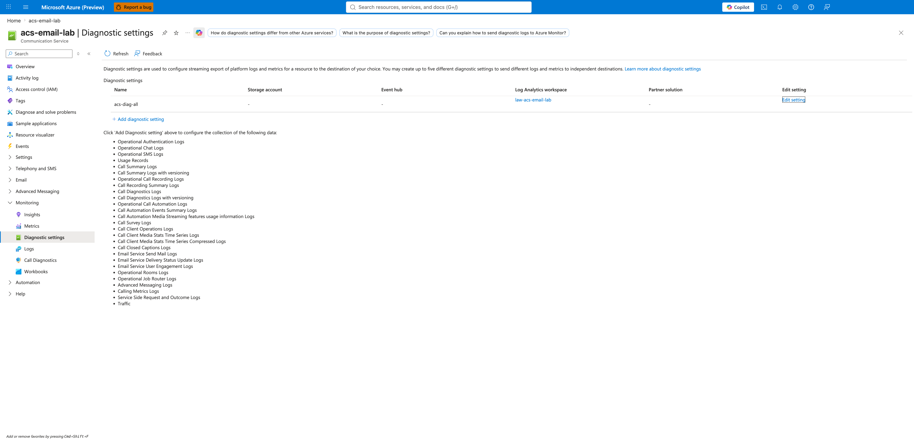
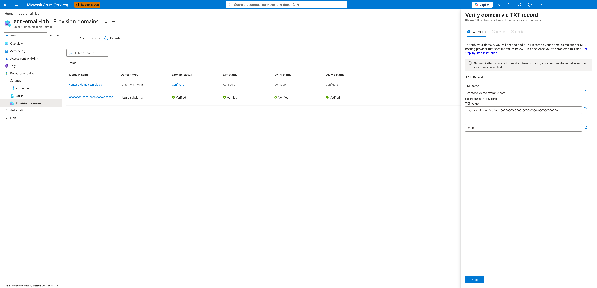
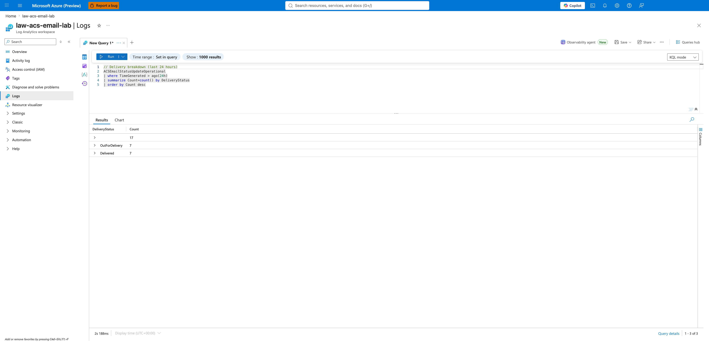

---
content_sources:
  - https://learn.microsoft.com/azure/communication-services/concepts/analytics/logs/email-logs
  - https://learn.microsoft.com/azure/communication-services/concepts/email/troubleshooting
content_validation:
  status: verified
  last_reviewed: 2026-06-26
  reviewer: agent
  core_claims:
    - claim: "The ACSEmailStatusUpdateOperational table records the delivery lifecycle for emails sent via ACS"
      source: https://learn.microsoft.com/azure/communication-services/concepts/analytics/logs/email-logs
      verified: true
    - claim: "Diagnostic settings must be configured on the ACS resource (not the Email Communication Service) to route email logs to Log Analytics"
      source: https://learn.microsoft.com/azure/communication-services/concepts/logging-and-diagnostics
      verified: true
    - claim: "Sending from non-verified domains (e.g., @outlook.com, @gmail.com) is not supported"
      source: https://learn.microsoft.com/azure/communication-services/concepts/email/email-domain-and-sender-authentication
      verified: true
---

# Email Delivery Checklist (First 10 Minutes)

When email delivery fails or domain verification is blocked, follow these initial steps.

## Step 0. Confirm diagnostic settings are routing email logs

Before running KQL queries, confirm that diagnostic settings on the **ACS resource** (not the Email Communication Service) are routing email logs to a Log Analytics workspace. Without this, the KQL tables below will be empty regardless of what you send.

{ loading=lazy }

If the list view shows no diagnostic settings, or the destination is not the Log Analytics workspace you expect, see [Monitoring → Step 1. Create the Log Analytics workspace](../../operations/monitoring.md#step-1-create-the-log-analytics-workspace) to provision it. Logs typically appear within 5 minutes of the next send after the setting is enabled.

## Immediate Checklist

1. **Diagnostic settings present**: Are email logs being routed to Log Analytics (see Step 0)?
2. **Domain Verification Status**: Is the domain status `Verified` in the Azure Portal?
3. **DNS Record Check**: Are SPF, DKIM, and DMARC records correctly propagated?
4. **Sender Address Validity**: Does the `From` address match the verified domain?
5. **Spam Signals**: Is the email content triggering spam filters?
6. **Rate Limits**: Are you exceeding your sending tier (e.g., 100 emails/minute)?

## Custom domain DNS verification (visual reference)

For checklist items 2 and 3 above: when a custom domain row in the Provision domains grid shows `Configure` instead of `Verified`, click **Configure** on the relevant status column to open the per-record verification wizard.

{ loading=lazy }

Add the host name and value shown to your DNS zone as the matching record type. After DNS propagation (typically 1–5 minutes for low-TTL records, longer for high-TTL), click **Done** in the wizard to re-check. The Provision domains grid status flips from `Configure` to `Verified` once Azure can resolve the record. Each record type (Domain TXT, SPF, DKIM, DKIM2) opens its own separate wizard — DMARC is not surfaced in a wizard and must be configured directly in your DNS zone per the [Email Domain and Sender Authentication](https://learn.microsoft.com/azure/communication-services/concepts/email/email-domain-and-sender-authentication) guide.

## Essential CLI Commands

```bash
# Check domain verification status
az communication email domain list \
  --resource-group "<rg>" \
  --email-service-name "<email-service>"

# List all sender usernames for a domain
az communication email domain sender-username list \
  --domain-name "<domain>" \
  --email-service-name "<email-service>" \
  --resource-group "<rg>"

# Confirm the domain is linked to your ACS resource
az communication show \
  --name "<acs-resource>" \
  --resource-group "<rg>" \
  --query "linkedDomains" -o tsv
```

## Key KQL Queries

Run this in Log Analytics to see recent email delivery lifecycle events. Use `ACSEmailStatusUpdateOperational` — this is the actual table name (confirmed on real deployments); older docs may reference `ACSEmailDeliveryReportEvents`.

```kusto
// Recent non-delivered emails (last 1 hour) — recipient-level rows only
ACSEmailStatusUpdateOperational
| where TimeGenerated > ago(1h)
| where isnotempty(RecipientId)
| where DeliveryStatus !in ("Delivered", "OutForDelivery")
| project TimeGenerated, CorrelationID, RecipientId, DeliveryStatus, SmtpStatusCode, EnhancedSmtpStatusCode
| order by TimeGenerated desc
```

```kusto
// Delivery breakdown (last 24 hours)
ACSEmailStatusUpdateOperational
| where TimeGenerated > ago(24h)
| summarize Count=count() by DeliveryStatus
| order by Count desc
```

When the diagnostic pipeline is healthy, the breakdown query above returns one row per status. Each email produces ~3 lifecycle events — an empty/initial state, an `OutForDelivery` transition, and a terminal `Delivered` (or failure) status — so a 7-email send burst typically produces ~20-25 rows total.

{ loading=lazy }

If your breakdown shows only blank or only `OutForDelivery` rows (no `Delivered`), the recipient mail server is not yet ACK'ing — wait 5-10 minutes and re-run. If it shows `Bounced` or `Failed` rows, drill in with the bounce-detail query below.

```kusto
// Hard-bounce detail — recipient-level rows where IsHardBounce is true
ACSEmailStatusUpdateOperational
| where TimeGenerated > ago(24h)
| where isnotempty(RecipientId)
| where IsHardBounce == true
| project TimeGenerated, RecipientId, SmtpStatusCode, EnhancedSmtpStatusCode, SenderDomain
| order by TimeGenerated desc
```

`IsHardBounce` is a boolean per the [documented schema](https://learn.microsoft.com/azure/communication-services/concepts/analytics/logs/email-logs) — compare against `true`, not the string `"True"`. The recipient mail server is not exposed as a column; if you need to group bounces by destination provider, derive it from the `RecipientId` suffix (for example, `extend RecipientDomain = tostring(split(RecipientId, "@")[1])`).

## Immediate Triage Questions

- Are you using a free domain like `@outlook.com` or `@gmail.com` as the sender? (Not supported — ACS requires a domain you control or an AzureManagedDomain.)
- Is this a new custom domain that needs reputation warming up?
- Are the emails bouncing with a specific SMTP code (e.g., 550 user unknown, 421 service unavailable)?
- For AzureManagedDomain sends to consumer mailboxes (Gmail/Outlook/Yahoo): are recipients reporting the mail landed in Spam? AzureManagedDomain has neutral reputation — production traffic should use a custom verified domain with aligned SPF/DKIM/DMARC.

## See Also

- [Email Service Provisioning](../../operations/email-provisioning.md) — full provisioning walkthrough with screenshots
- [Monitoring Azure Communication Services](../../operations/monitoring.md) — Log Analytics setup and Email log schema
- [Email Delivery Failures Playbook](../playbooks/email/delivery-failures.md)
- [Domain Verification Playbook](../playbooks/email/domain-verification.md)

## Sources

- [ACS Email Logs Reference](https://learn.microsoft.com/azure/communication-services/concepts/analytics/logs/email-logs)
- [Azure Communication Services Email Troubleshooting](https://learn.microsoft.com/azure/communication-services/concepts/email/troubleshooting)
