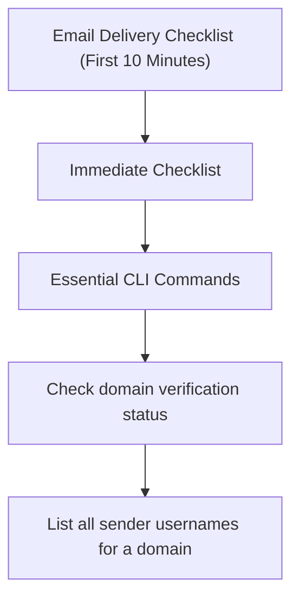

---
content_sources:
  sources:
  - type: mslearn-adapted
    url: https://learn.microsoft.com/azure/communication-services/concepts/email/email-domain-and-sender-authentication
  - type: mslearn-adapted
    url: https://learn.microsoft.com/azure/communication-services/concepts/service-limits
  - type: mslearn-adapted
    url: https://learn.microsoft.com/en-us/azure/azure-monitor/reference/acsemailstatusupdateoperational
  diagrams:
  - id: email-delivery-page-flow
    type: flowchart
    source: self-generated
    justification: Synthesized from the page structure and Microsoft Learn sources
      listed in this document.
    based_on:
    - https://learn.microsoft.com/azure/communication-services/concepts/email/email-domain-and-sender-authentication
content_validation:
  status: pending_review
  last_reviewed: null
  reviewer: agent
  core_claims: []
---
# Email Delivery Checklist (First 10 Minutes)

When email delivery fails or domain verification is blocked, follow these initial steps.

## Immediate Checklist

1. **Domain Verification Status**: Is the domain status `Verified` in the Azure Portal?
2. **DNS Record Check**: Are SPF, DKIM, and DMARC records correctly propagated?
3. **Sender Address Validity**: Does the `From` address match the verified domain?
4. **Spam Signals**: Is the email content triggering spam filters?
5. **Rate Limits**: Are you exceeding your current sender tier? Azure managed domains allow only 5 sends/minute and 10 sends/hour per subscription.

## Essential CLI Commands

```bash
# Check domain verification status
az communication email domain list --resource-group "<rg>" --email-service-name "<email-service>"

# List all sender usernames for a domain
az communication email domain sender-username list --domain-name "<domain>" --email-service-name "<email-service>"
```

## Key KQL Queries

Run this to see recent email delivery issues:

```kusto
ACSEmailStatusUpdateOperational
| where TimeGenerated > ago(1h)
| where DeliveryStatus != "Delivered"
| summarize Count=count() by DeliveryStatus, FailureReason, SmtpStatusCode, RecipientId
| order by Count desc
```

## Immediate Triage Questions

* Are you using a free domain like `@outlook.com` or `@gmail.com` as the sender? (Not supported)
* Is this a new domain that needs warming up?
* Are the emails bouncing with a specific SMTP code (e.g., 550)?

## Page Flow

<!-- diagram-id: email-delivery-page-flow -->


## Review Matrix

| Review area | Page-specific check |
|---|---|
| Scope | Confirm the guidance applies to Email Delivery Checklist (First 10 Minutes). |
| Source basis | Validate the recommendation against the Microsoft Learn sources in this page. |
| Evidence | Capture command output, portal state, metrics, logs, or screenshots before treating the result as proven. |

## See Also
* [Email Delivery Failures Playbook](../playbooks/email/delivery-failures.md)
* [Domain Verification Playbook](../playbooks/email/domain-verification.md)

## Sources
* [Email domain and sender authentication](https://learn.microsoft.com/azure/communication-services/concepts/email/email-domain-and-sender-authentication)
* [ACS service limits](https://learn.microsoft.com/azure/communication-services/concepts/service-limits)
* [ACSEmailStatusUpdateOperational table](https://learn.microsoft.com/en-us/azure/azure-monitor/reference/acsemailstatusupdateoperational)
