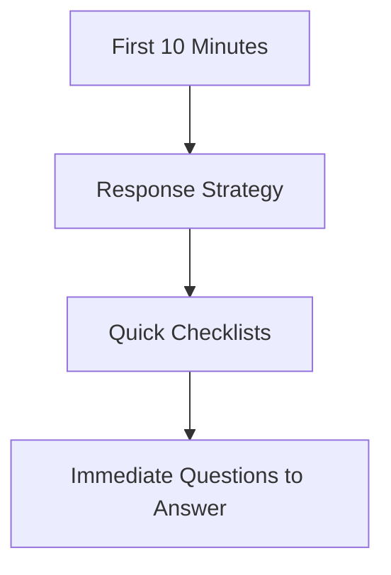

---
content_sources:
  sources:
  - type: mslearn-adapted
    url: azure-docs
  - type: mslearn-adapted
    url: emergency-response
  diagrams:
  - id: index-page-flow
    type: flowchart
    source: self-generated
    justification: Synthesized from the page structure and Microsoft Learn sources
      listed in this document.
    based_on:
    - https://learn.microsoft.com/en-us/azure/communication-services/overview
content_validation:
  status: pending_review
  last_reviewed: null
  reviewer: agent
  core_claims: []
---
# First 10 Minutes

When an incident starts, these checklists help you quickly stabilize and identify the scope of the issue.

## Response Strategy

A structured response in the first minutes prevents chaotic troubleshooting and speeds up resolution.

| Step | Action | Description |
| --- | --- | --- |
| 1 | Scope | Determine if the issue is global, regional, or specific to a user/resource. |
| 2 | Check Health | Review the Azure Service Health dashboard. |
| 3 | Triage Channel | Use the channel-specific checklists below. |
| 4 | Gather Evidence | Collect recent logs and metrics. |

## Quick Checklists

* [SMS Delivery Checklist](sms-delivery.md) - For issues with outbound SMS.
* [Email Delivery Checklist](email-delivery.md) - For email bouncing or verification issues.
* [Chat Connectivity Checklist](chat-connectivity.md) - For real-time messaging failures.
* [Calling Quality Checklist](calling-quality.md) - For voice and video issues.

## Immediate Questions to Answer

* Did anything change in the environment recently? (Code deploy, configuration change)
* Is the issue reproducible?
* Are all users affected, or just a subset?
* Is there an ongoing Azure region outage?

## Page Flow

<!-- diagram-id: index-page-flow -->

## See Also
* [Troubleshooting Overview](../index.md)
* [Decision Tree](../decision-tree.md)

## Sources
* Azure Incident Response Framework
* Support Engineering Triage Guide
