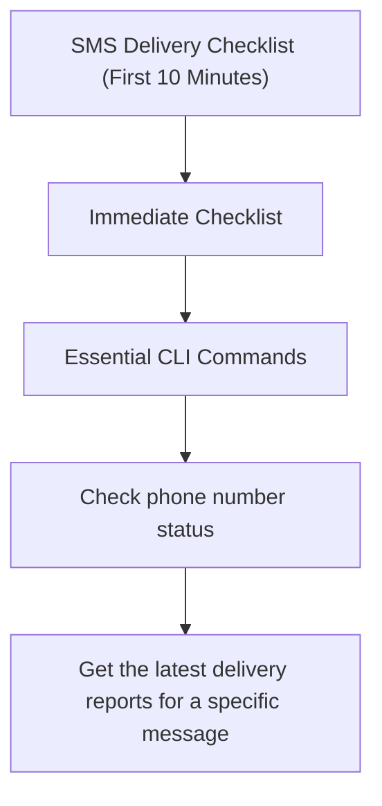

---
content_sources:
  sources:
  - type: mslearn-adapted
    url: https://learn.microsoft.com/azure/communication-services/concepts/service-limits
  - type: mslearn-adapted
    url: https://learn.microsoft.com/azure/communication-services/concepts/analytics/logs/sms-logs
  - type: mslearn-adapted
    url: https://learn.microsoft.com/en-us/azure/azure-monitor/reference/acssmsincomingoperations
  diagrams:
  - id: sms-delivery-page-flow
    type: flowchart
    source: self-generated
    justification: Synthesized from the page structure and Microsoft Learn sources
      listed in this document.
    based_on:
    - https://learn.microsoft.com/azure/communication-services/concepts/service-limits
content_validation:
  status: pending_review
  last_reviewed: null
  reviewer: agent
  core_claims: []
---
# SMS Delivery Checklist (First 10 Minutes)

When SMS delivery failures occur, follow this checklist to quickly isolate the cause.

## Immediate Checklist

1. **Check Phone Number Status**: Is the number active?
2. **Review Opt-out Lists**: Is the recipient on a suppression or STOP list?
3. **Analyze Message Content**: Does it contain spam keywords or suspicious URLs?
4. **Check Rate Limits**: Are you exceeding your throughput (MPS) limits?
5. **Verify Number Format**: Is the recipient number in correct E.164 format?

## Essential CLI Commands

```bash
# Check phone number status
az communication sms number list --connection-string "<your_connection_string>"

# Get the latest delivery reports for a specific message
# Replace message-id with the actual ID from your logs
az communication sms get-delivery-report --message-id "<message_id>" --connection-string "<your_connection_string>"
```

## Key KQL Queries

Run this in Log Analytics to see recent delivery failures and their reasons:

```kusto
ACSSMSIncomingOperations
| where TimeGenerated > ago(1h)
| where ResultType != "Succeeded"
| summarize Count=count() by ResultSignature, ResultDescription, PhoneNumber
| order by Count desc
```

## Immediate Triage Questions

* Is the failure happening for all carriers or just one?
* Are you sending international messages from a local number?
* Is your ACS resource in a region that supports the destination?

## Page Flow

<!-- diagram-id: sms-delivery-page-flow -->


## Review Matrix

| Review area | Page-specific check |
|---|---|
| Scope | Confirm the guidance applies to SMS Delivery Checklist (First 10 Minutes). |
| Source basis | Validate the recommendation against the Microsoft Learn sources in this page. |
| Evidence | Capture command output, portal state, metrics, logs, or screenshots before treating the result as proven. |

## See Also
* [SMS Delivery Failures Playbook](../playbooks/sms/delivery-failures.md)
* [SMS Rate Limiting Playbook](../playbooks/sms/rate-limiting.md)

## Sources
* [ACS service limits](https://learn.microsoft.com/azure/communication-services/concepts/service-limits)
* [SMS logs](https://learn.microsoft.com/azure/communication-services/concepts/analytics/logs/sms-logs)
* [ACSSMSIncomingOperations table](https://learn.microsoft.com/en-us/azure/azure-monitor/reference/acssmsincomingoperations)
