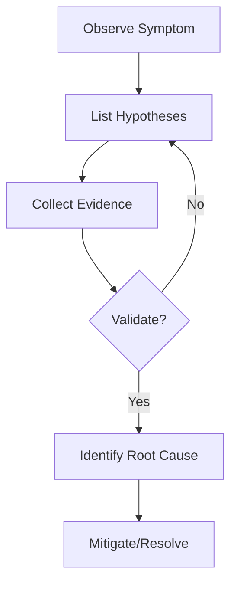
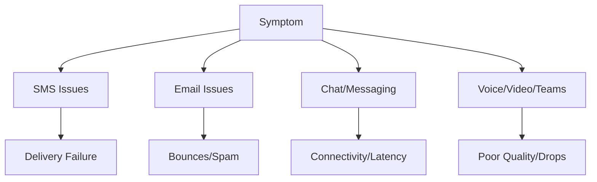

---
content_sources:
  diagrams:
    - id: troubleshooting-method-flow
      type: flowchart
      source: self-generated
      justification: Original hypothesis-driven troubleshooting workflow used throughout this guide.
    - id: troubleshooting-decision-tree
      type: flowchart
      source: self-generated
      justification: Original high-level symptom-to-playbook decision tree overview.
---

# Troubleshooting Overview

This guide provides a structured, hypothesis-driven approach to diagnosing and resolving issues across Azure Communication Services (ACS).

## How It Works

<!-- diagram-id: troubleshooting-method-flow -->

## Start Here

| Scenario | Action |
| --- | --- |
| First time responding to an ACS incident | Go to [First 10 Minutes](first-10-minutes/index.md) |
| Known channel issue (SMS, Email, etc.) | Browse [Playbooks](playbooks/index.md) |
| Need specialized telemetry data | Review [Evidence Map](evidence-map.md) |
| Performing advanced analysis | Use [KQL Query Library](kql/index.md) |

## Quick Routing

<!-- diagram-id: troubleshooting-decision-tree -->

## Symptom Table

| Channel | Common Symptom | Potential Playbook |
| --- | --- | --- |
| **SMS** | Message not received | [SMS Delivery Failure](playbooks/sms/delivery-failures.md) |
| **Email** | Verification failing | [Domain Verification](playbooks/email/domain-verification.md) |
| **Chat** | Real-time events missing | [Real-time Notifications](playbooks/chat/real-time-notifications.md) |
| **Voice/Video** | Call drops after 30s | [Call Drops](playbooks/voice-video/call-drops.md) |
| **Teams Interop** | Cannot join meeting | [Teams Join Failures](playbooks/teams-interop/join-failures.md) |

## Representative Error Patterns

| Error Code | Meaning | Likely Cause |
| --- | --- | --- |
| `429` | Too Many Requests | Throttling/Rate limits exceeded |
| `401` | Unauthorized | Expired token or invalid credential |
| `403` | Forbidden | Insufficient permissions for resource |
| `404` | Not Found | Resource (thread, user) deleted or invalid |

## Topics

* [Decision Tree](decision-tree.md)
* [Evidence Map](evidence-map.md)
* [Mental Model](mental-model.md)
* [Methodology](methodology/troubleshooting-method.md)

## See Also
* [Azure Monitor Documentation](https://learn.microsoft.com/en-us/azure/azure-monitor/)
* [ACS Diagnostic Logs](https://learn.microsoft.com/en-us/azure/communication-services/concepts/analytics/diagnostic-logging)

## Sources
* Internal Support Playbooks
* Azure SDK Troubleshooting Guides
