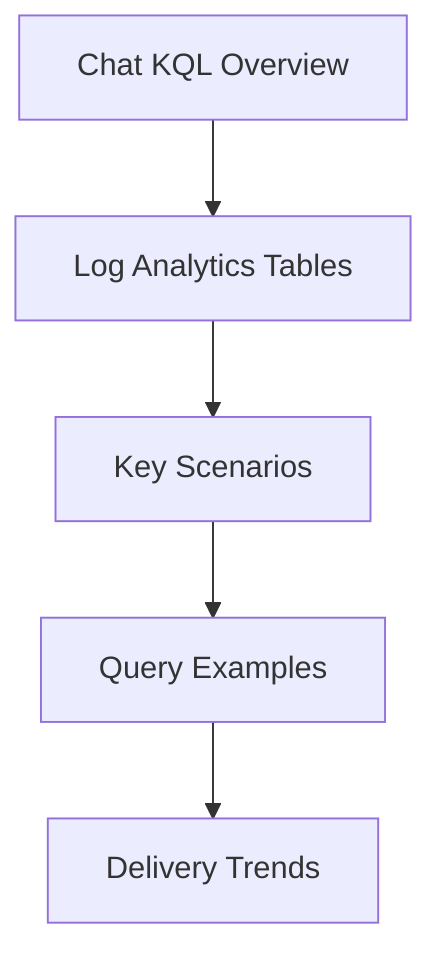

---
content_sources:
  sources:
  - type: mslearn-adapted
    url: https://learn.microsoft.com/azure/communication-services/concepts/analytics/logs/chat-logs
  - type: mslearn-adapted
    url: https://learn.microsoft.com/en-us/azure/azure-monitor/reference/acschatincomingoperations
  diagrams:
  - id: index-page-flow
    type: flowchart
    source: self-generated
    justification: Synthesized from the page structure and Microsoft Learn sources
      listed in this document.
    based_on:
    - https://learn.microsoft.com/azure/communication-services/concepts/analytics/logs/chat-logs
content_validation:
  status: pending_review
  last_reviewed: null
  reviewer: agent
  core_claims: []
---
# Chat KQL Overview

Analyze chat message delivery performance, error patterns, and latency.

## Log Analytics Tables

* **ACSChatIncomingOperations**: Chat operation logs, including operation name, result type, duration, chat thread ID, and user ID.

## Key Scenarios

| Scenario | KQL Query | Description |
| --- | --- | --- |
| **Message Latency Analysis** | [Chat Message Latency](message-latency.md) | Find the average and maximum latency for chat messages. |
| **Message Delivery Trends** | [Delivery Trends](#delivery-trends) | Track the volume of chat messages over time. |
| **Thread Creation Volume** | [Thread Volume](#thread-creation-volume) | Track the number of chat threads created per resource. |

## Query Examples

### Delivery Trends
Track the volume of chat messages grouped by time.

```kusto
ACSChatIncomingOperations
| where TimeGenerated > ago(24h)
| summarize MessageCount = count() by OperationName, bin(TimeGenerated, 1h)
| render timechart
```

### Thread Creation Volume
Track the number of chat threads created per resource.

```kusto
ACSChatIncomingOperations
| where TimeGenerated > ago(24h)
| where OperationName has "CreateChatThread"
| summarize ThreadCount = count() by bin(TimeGenerated, 1h)
| render timechart
```

## Page Flow

<!-- diagram-id: index-page-flow -->


## See Also
* [Chat Message Latency KQL](message-latency.md)
* [Chat Message Delivery Playbook](../../playbooks/chat/message-delivery.md)

## Sources
* [Chat logs](https://learn.microsoft.com/azure/communication-services/concepts/analytics/logs/chat-logs)
* [ACSChatIncomingOperations table](https://learn.microsoft.com/en-us/azure/azure-monitor/reference/acschatincomingoperations)
