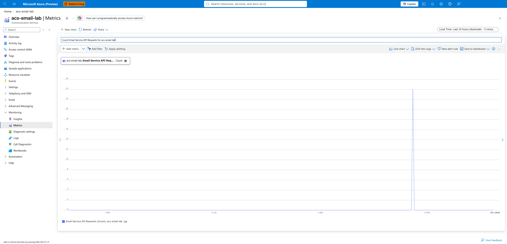

---
content_sources:
  - azure-docs
  - email-log-analytics
---

# Email KQL Overview

Analyze email delivery performance, error patterns, and throughput.

## Log Analytics Tables

ACS Email surfaces three Operational tables (see the [ACS Email Logs schema](https://learn.microsoft.com/azure/communication-services/concepts/analytics/logs/email-logs)):

* **`ACSEmailSendMailOperational`** — One row per `SendEmail` API call. Tracks send-side metadata (correlation ID, recipient counts, attachment counts, size). Does **not** expose delivery status.
* **`ACSEmailStatusUpdateOperational`** — One row per lifecycle transition. Tracks per-recipient delivery state (`Delivered`, `Bounced`, `Failed`, etc.) via `DeliveryStatus`, plus `SmtpStatusCode`, `EnhancedSmtpStatusCode`, and `IsHardBounce` (string per the [documented schema](https://learn.microsoft.com/en-us/azure/azure-monitor/reference/tables/acsemailstatusupdateoperational)).
* **`ACSEmailUserEngagementOperational`** — One row per recipient interaction (open, click) when engagement tracking is enabled.

## Key Scenarios

| Scenario | KQL Query | Description |
| --- | --- | --- |
| **Total Send Volume** | [Send Volume](#total-send-volume) | Count `SendEmail` API calls (daily total, hourly trend, 7-day rollup). |
| **Delivery Failure Analysis** | [Email Delivery Status](delivery-status.md) | Find the most common reasons for bounced or failed emails. |
| **Bounce Rate Trends** | [Bounce Trends](#bounce-rate-trends) | Track the bounce rate of emails over time. |
| **Sender Failure Rate** | [Sender Failure Rate](#sender-failure-rate) | Surface senders with elevated failure rates (a proxy for throttling or reputation issues). |

## Query Examples

### Total Send Volume

`ACSEmailSendMailOperational` is the send-side ground truth: one row per `SendEmail` API call. Use it when you need the **count of send attempts** (not delivery outcomes — those live in `ACSEmailStatusUpdateOperational`).

#### Daily total send count

The simplest "how many emails did we attempt to send today" query — single number, no buckets.

```kusto
ACSEmailSendMailOperational
| where TimeGenerated > ago(1d)
| summarize TotalSends = count()
```

#### Hourly send trend (timechart)

For monitoring spikes and quiet periods over the last 24 hours, bucket by hour and render as a line chart.

```kusto
ACSEmailSendMailOperational
| where TimeGenerated > ago(24h)
| summarize Sends = count() by bin(TimeGenerated, 1h)
| order by TimeGenerated asc
| render timechart
```

#### 7-day rollup with recipient fan-out

For weekly capacity planning, group by day and surface the total emails attempted plus the total recipients (one send can hit many recipients via To/Cc/Bcc):

```kusto
ACSEmailSendMailOperational
| where TimeGenerated > ago(7d)
| summarize
    Sends = count(),
    TotalRecipients = sum(UniqueRecipientsCount),
    TotalSizeMB = round(sum(Size), 2)
    by Day = bin(TimeGenerated, 1d)
| order by Day asc
```

`UniqueRecipientsCount` counts every distinct recipient on a single `SendEmail` call (across To, Cc, Bcc). `Size` is the email size in megabytes per the [documented schema](https://learn.microsoft.com/azure/azure-monitor/reference/tables/acsemailsendmailoperational).

#### Send volume by sender domain (via join)

`ACSEmailSendMailOperational` does **not** expose `SenderDomain` as a documented column per the [Microsoft Learn schema](https://learn.microsoft.com/azure/azure-monitor/reference/tables/acsemailsendmailoperational) — only `ACSEmailStatusUpdateOperational` does. To attribute send volume per sender domain, join the two tables on `CorrelationId`:

```kusto
let SendRows =
    ACSEmailSendMailOperational
    | where TimeGenerated > ago(7d)
    | project CorrelationId, SendTime = TimeGenerated;
let StatusRows =
    ACSEmailStatusUpdateOperational
    | where TimeGenerated > ago(7d)
    | where isnotempty(SenderDomain)
    | summarize arg_min(TimeGenerated, SenderDomain) by CorrelationId;
SendRows
| join kind=inner StatusRows on CorrelationId
| summarize Sends = dcount(CorrelationId) by bin(SendTime, 1d), SenderDomain
| order by SendTime asc
```

`arg_min` picks the first status row per `CorrelationId` to avoid double-counting (each send produces multiple status rows). `dcount(CorrelationId)` then counts each send exactly once even if the join multiplies rows.

!!! note "Inner join excludes pending sends"
    `kind=inner` excludes very recent sends whose status rows have not yet been written. For near-real-time send totals, use the *Daily total send count* query against `ACSEmailSendMailOperational` directly. Use this join for historical attribution (yesterday and older), not for current-hour dashboards.

#### Reconciling KQL count vs Portal Metric

You will see two slightly different numbers for the same time window:

| Source | What it represents |
|---|---|
| `ACSEmailSendMailOperational` (this table) | Log row per `SendEmail` operation (send-side operational record per the [documented schema](https://learn.microsoft.com/azure/azure-monitor/reference/tables/acsemailsendmailoperational)) |
| `Email Service API Requests` metric (Portal → Metrics) | Aggregated API request count surfaced on the [Communication Services standard metrics](https://learn.microsoft.com/azure/communication-services/concepts/metrics) blade |

The two are different telemetry surfaces — one is operational logs, the other is platform metrics — so counts may differ for the same time window and should be reconciled loosely. For "how many emails did our application attempt to deliver", trust `ACSEmailSendMailOperational`. For "how is the API endpoint trending in Portal alerts and dashboards", trust the metric. See [Monitoring → Viewing Email Metrics in Azure Monitor](../../../operations/monitoring.md#viewing-email-metrics-in-azure-monitor) for the Portal-side view of this same data.

{ loading=lazy }

The capture above shows the **Portal Metrics view** of the same send-volume data — a 24-request spike at 12 PM Friday. The *Daily total send count* KQL run against the same workspace may return a slightly different number because the two are independent telemetry pipelines.

#### Cross-check with status updates

To prove the send volume produced expected lifecycle events, run the breakdown query from [Email Delivery Checklist](../../first-10-minutes/email-delivery.md#key-kql-queries):

```kusto
ACSEmailStatusUpdateOperational
| where TimeGenerated > ago(24h)
| summarize Count=count() by DeliveryStatus
| order by Count desc
```

{ loading=lazy }

A 7-email send burst can produce many more status-update rows than sends because `ACSEmailStatusUpdateOperational` records lifecycle transitions rather than one row per send. In the capture above, 7 sends correspond to **31 status-update rows** (17 blank/initial + 7 `OutForDelivery` + 7 `Delivered`), which is consistent with a healthy delivery pipeline. To compare 1:1 against send-side rows, filter the status table with `where isnotempty(RecipientId)` to get only recipient-level terminal transitions.

### Bounce Rate Trends
Track the percentage of recipient-level rows that did not reach `Delivered`, bucketed hourly.

```kusto
ACSEmailStatusUpdateOperational
| where TimeGenerated > ago(24h)
| where isnotempty(RecipientId)
| summarize
    TotalRecipients = count(),
    Failed = countif(DeliveryStatus != "Delivered")
    by bin(TimeGenerated, 1h)
| project TimeGenerated, BounceRate = (toreal(Failed) / TotalRecipients) * 100
| render timechart
```

`isnotempty(RecipientId)` filters out the message-level rows (`Dropped`, `OutForDelivery`, `Queued`), keeping only recipient-level transitions so each recipient is counted exactly once.

### Sender Failure Rate
The Email schema does not expose an explicit `Throttled` delivery status. To surface senders that may be hitting throttling or reputation issues, look for elevated failure rates per `SenderDomain` instead:

```kusto
ACSEmailStatusUpdateOperational
| where TimeGenerated > ago(1h)
| where isnotempty(RecipientId)
| summarize
    Total = count(),
    Failed = countif(DeliveryStatus in ("Failed", "Bounced", "Quarantined"))
    by SenderDomain
| extend FailureRate = todouble(Failed) / todouble(Total)
| where Total >= 20 and FailureRate > 0.10
| order by FailureRate desc
```

If you need finer-grained signals, group by `SenderDomain, SenderUsername` and inspect `SmtpStatusCode` / `EnhancedSmtpStatusCode` on the failing rows for the carrier's reason code.

## See Also
* [Email Delivery Status KQL](delivery-status.md)
* [Email Delivery Failures Playbook](../../playbooks/email/delivery-failures.md)
* [Monitoring Azure Communication Services](../../../operations/monitoring.md) — full Log Analytics + alert setup

## Sources
* [ACS Email Logs Reference (Microsoft Learn)](https://learn.microsoft.com/azure/communication-services/concepts/analytics/logs/email-logs)
