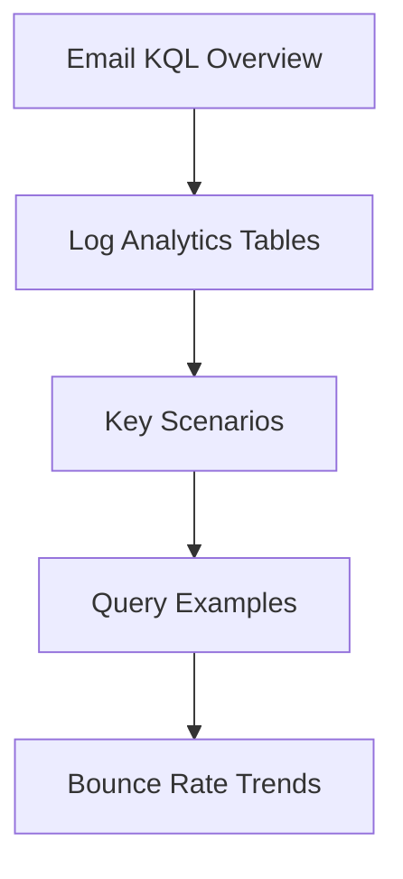

---
content_sources:
  sources:
  - type: mslearn-adapted
    url: https://learn.microsoft.com/en-us/azure/azure-monitor/reference/acsemailsendmailoperational
  - type: mslearn-adapted
    url: https://learn.microsoft.com/en-us/azure/azure-monitor/reference/acsemailstatusupdateoperational
  - type: mslearn-adapted
    url: https://learn.microsoft.com/en-us/azure/azure-monitor/reference/acsemailuserengagementoperational
  diagrams:
  - id: index-page-flow
    type: flowchart
    source: self-generated
    justification: Synthesized from the page structure and Microsoft Learn sources
      listed in this document.
    based_on:
    - https://learn.microsoft.com/en-us/azure/azure-monitor/reference/acsemailsendmailoperational
content_validation:
  status: pending_review
  last_reviewed: null
  reviewer: agent
  core_claims: []
---
# Email KQL Overview

Analyze email delivery performance, error patterns, and throughput.

## Log Analytics Tables

* **ACSEmailSendMailOperational**: Send operations, recipient counts, message size, and sender context.
* **ACSEmailStatusUpdateOperational**: Delivery status updates, SMTP codes, failure reason, and bounce classification.
* **ACSEmailUserEngagementOperational**: User engagement events when engagement logging is enabled.

## Key Scenarios

| Scenario | KQL Query | Description |
| --- | --- | --- |
| **Delivery Failure Analysis** | [Email Delivery Status](delivery-status.md) | Find the most common reasons for bounced or failed emails. |
| **Bounce Rate Trends** | [Bounce Trends](#bounce-rate-trends) | Track the bounce rate of emails over time. |
| **Sending Tier Analysis** | [Sending Tier](#sending-tier-analysis) | Identify if any domains are hitting sending tier limits. |

## Query Examples

### Bounce Rate Trends
Track the percentage of emails that failed delivery over time.

```kusto
ACSEmailStatusUpdateOperational
| where TimeGenerated > ago(24h)
| summarize
    TotalSent = count(),
    TotalFailed = countif(DeliveryStatus != "Delivered")
    by bin(TimeGenerated, 1h)
| project TimeGenerated, BounceRate = (toreal(TotalFailed) / TotalSent) * 100
| render timechart
```

### Sending Tier Analysis
Identify if any sender domains are hitting rate limits.

```kusto
ACSEmailStatusUpdateOperational
| where TimeGenerated > ago(1h)
| where FailureReason has "Throttled"
    or FailureMessage has "429"
    or SmtpStatusCode == "429"
| summarize ThrottledCount = count() by SenderDomain, SenderUsername
| order by ThrottledCount desc
```

## Page Flow

<!-- diagram-id: index-page-flow -->


## See Also
* [Email Delivery Status KQL](delivery-status.md)
* [Email Delivery Failures Playbook](../../playbooks/email/delivery-failures.md)

## Sources
* [ACSEmailSendMailOperational table](https://learn.microsoft.com/en-us/azure/azure-monitor/reference/acsemailsendmailoperational)
* [ACSEmailStatusUpdateOperational table](https://learn.microsoft.com/en-us/azure/azure-monitor/reference/acsemailstatusupdateoperational)
* [ACSEmailUserEngagementOperational table](https://learn.microsoft.com/en-us/azure/azure-monitor/reference/acsemailuserengagementoperational)
