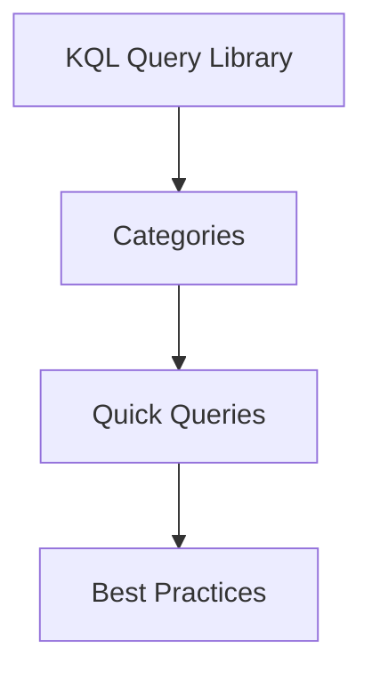

---
content_sources:
  sources:
  - type: mslearn-adapted
    url: https://learn.microsoft.com/en-us/azure/azure-monitor/logs/log-analytics-overviewlog-analytics-tutorial
  - type: mslearn-adapted
    url: https://learn.microsoft.com/en-us/azure/azure-monitor/reference/microsoft-communication-communicationservices
  diagrams:
  - id: index-page-flow
    type: flowchart
    source: self-generated
    justification: Synthesized from the page structure and Microsoft Learn sources
      listed in this document.
    based_on:
    - https://learn.microsoft.com/en-us/azure/azure-monitor/logs/log-analytics-overviewlog-analytics-tutorial
content_validation:
  status: pending_review
  last_reviewed: null
  reviewer: agent
  core_claims: []
---
# KQL Query Library

A collection of pre-built KQL queries for analyzing and troubleshooting ACS activities in Log Analytics.

## Categories

| Category | Description | Overview |
| --- | --- | --- |
| **SMS** | Delivery tracking, error analysis, and rate limiting logs. | [SMS KQL Overview](sms/index.md) |
| **Email** | Bounces, domain verification, and delivery performance. | [Email KQL Overview](email/index.md) |
| **Chat** | Latency, message delivery, and thread activity analysis. | [Chat KQL Overview](chat/index.md) |
| **Voice/Video** | Call quality, media performance, and call drops. | [Voice/Video KQL Overview](voice-video/index.md) |
| **General** | Resource-level diagnostic events and summary logs. | [Detector Map](../methodology/detector-map.md) |

## Quick Queries

* [SMS Delivery Status](sms/delivery-status.md)
* [Email Delivery Status](email/delivery-status.md)
* [Chat Message Latency](chat/message-latency.md)
* [Call Quality Metrics](voice-video/call-quality-metrics.md)

## Best Practices

* **Filter by Time**: Always include `TimeGenerated > ago(1h)` to limit the query scope and improve performance.
* **Join Tables Carefully**: Use `join` sparingly, especially on large tables like `ACSCallDiagnostics`.
* **Use Summarize**: Group data by relevant fields (e.g., `ResultSignature`, `Status`) to identify common failure patterns.
* **Visualize Results**: Use `render barchart` or `render timechart` to visualize trends and anomalies.

## Page Flow

<!-- diagram-id: index-page-flow -->

## See Also
* [Evidence Map](../evidence-map.md)
* [Detector Map](../methodology/detector-map.md)

## Sources
* [Log Analytics tutorial](https://learn.microsoft.com/en-us/azure/azure-monitor/logs/log-analytics-overviewlog-analytics-tutorial)
* [ACS Log Analytics tables](https://learn.microsoft.com/en-us/azure/azure-monitor/reference/microsoft-communication-communicationservices)
