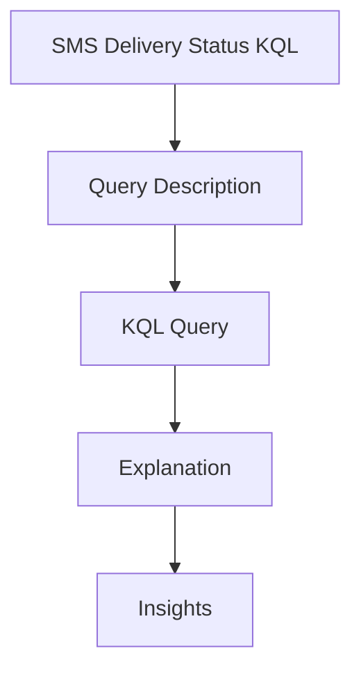

---
content_sources:
  sources:
  - type: mslearn-adapted
    url: https://learn.microsoft.com/azure/communication-services/concepts/analytics/logs/sms-logs
  - type: mslearn-adapted
    url: https://learn.microsoft.com/en-us/azure/azure-monitor/reference/acssmsincomingoperations
  diagrams:
  - id: delivery-status-page-flow
    type: flowchart
    source: self-generated
    justification: Synthesized from the page structure and Microsoft Learn sources
      listed in this document.
    based_on:
    - https://learn.microsoft.com/azure/communication-services/concepts/analytics/logs/sms-logs
content_validation:
  status: pending_review
  last_reviewed: null
  reviewer: agent
  core_claims: []
---
# SMS Delivery Status KQL

Analyze SMS delivery success rates and identify common failure reasons.

## Query Description

This query retrieves recent SMS delivery reports, filters for failures, and summarizes the most common reasons and destination numbers.

## KQL Query

```kusto
ACSSMSIncomingOperations
| where TimeGenerated > ago(1h)
| where ResultType != "Succeeded"
| summarize
    FailureCount = count(),
    SamplePhoneNumber = take_any(PhoneNumber),
    SampleMessageId = take_any(MessageId)
    by ResultSignature, ResultDescription
| order by FailureCount desc
```

## Explanation

| Field | Description |
| --- | --- |
| `TimeGenerated > ago(1h)` | Filters results to the last hour to focus on current issues and improve performance. |
| `ResultType != "Succeeded"` | Selects operations that did not complete successfully. |
| `summarize FailureCount = count()` | Counts the number of occurrences for each failure reason. |
| `by ResultSignature, ResultDescription` | Groups by the operation status code and status text. |
| `SamplePhoneNumber, SampleMessageId` | Provides representative examples to help with further investigation and reproduction. |

## Insights

* **Observed Errors**: Look for codes like `400`, `429`, or carrier-specific messages.
* **Carrier Filtering**: If `ResultDescription` mentions filtering or blocked content, adjust the message and sender pattern.
* **Volume Analysis**: A high count of `Throttled` errors suggests that the MPS limit for the sender number has been exceeded.

## Page Flow

<!-- diagram-id: delivery-status-page-flow -->


## See Also
* [SMS KQL Overview](index.md)
* [SMS Delivery Failures Playbook](../../playbooks/sms/delivery-failures.md)

## Sources
* [SMS logs](https://learn.microsoft.com/azure/communication-services/concepts/analytics/logs/sms-logs)
* [ACSSMSIncomingOperations table](https://learn.microsoft.com/en-us/azure/azure-monitor/reference/acssmsincomingoperations)
