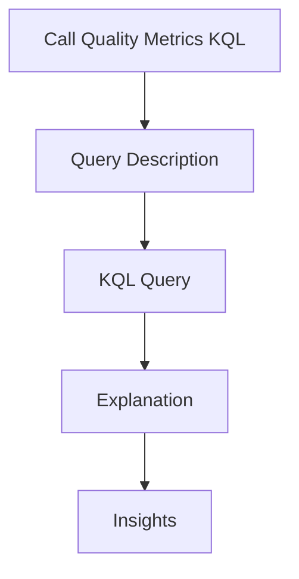

---
content_sources:
  sources:
  - type: mslearn-adapted
    url: https://learn.microsoft.com/azure/communication-services/concepts/analytics/logs/voice-and-video-logs
  - type: mslearn-adapted
    url: https://learn.microsoft.com/en-us/azure/azure-monitor/reference/acscalldiagnostics
  diagrams:
  - id: call-quality-metrics-page-flow
    type: flowchart
    source: self-generated
    justification: Synthesized from the page structure and Microsoft Learn sources
      listed in this document.
    based_on:
    - https://learn.microsoft.com/azure/communication-services/concepts/analytics/logs/voice-and-video-logs
content_validation:
  status: pending_review
  last_reviewed: null
  reviewer: agent
  core_claims: []
---
# Call Quality Metrics KQL

Analyze call quality and identify common media performance issues.

## Query Description

This query retrieves recent call diagnostic events, filters for poor quality, and summarizes the average latency, jitter, and packet loss for each call.

## KQL Query

```kusto
ACSCallDiagnostics
| where TimeGenerated > ago(1h)
| summarize
    AverageRoundTripTimeMs = avg(RoundTripTimeAvg),
    AverageJitterMs = avg(JitterAvg),
    AveragePacketLoss = avg(PacketLossRateAvg)
    by Identifier, MediaType, StreamDirection
| order by AveragePacketLoss desc
```

## Explanation

| Field | Description |
| --- | --- |
| `TimeGenerated > ago(1h)` | Filters results to the last hour to focus on current issues and improve performance. |
| `RoundTripTimeAvg`, `JitterAvg`, `PacketLossRateAvg` | Documented media diagnostic fields in `ACSCallDiagnostics`. |
| `summarize AverageRoundTripTimeMs, AverageJitterMs, AveragePacketLoss` | Calculates average values for each media stream group. |
| `by Identifier, MediaType, StreamDirection` | Groups results by call identifier and media stream. |

## Insights

* **Observed Latency**: Look for average latency greater than 200ms, which may be noticeable to users.
* **Network Performance**: High jitter or packet loss for a specific call ID suggests a network issue.
* **Volume Analysis**: A high count of calls with poor quality may suggest a service-level issue or heavy load.

## Page Flow

<!-- diagram-id: call-quality-metrics-page-flow -->


## See Also
* [Voice/Video KQL Overview](index.md)
* [Call Quality Playbook](../../playbooks/voice-video/call-quality.md)

## Sources
* [Voice and video call logs](https://learn.microsoft.com/azure/communication-services/concepts/analytics/logs/voice-and-video-logs)
* [ACSCallDiagnostics table](https://learn.microsoft.com/en-us/azure/azure-monitor/reference/acscalldiagnostics)
