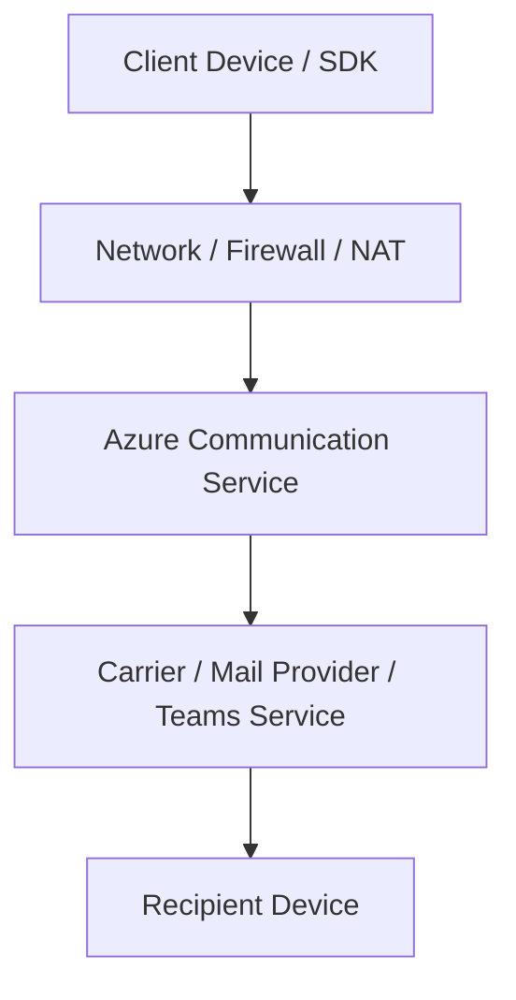

# Mental Model

A framework for hypothesis-driven ACS diagnosis. Understanding the logical layers of communication helps isolate root causes.

## Logical Layers of ACS

ACS interactions span from client devices to global cloud services. Isolating the layer of failure is the first step in troubleshooting.

<!-- diagram-id: mental-model-layers -->

## Layered Diagnosis Approach

### 1. SDK Layer (Client-side)
* **Symptoms**: UI issues, initialization errors, token expiration, local device access failures.
* **Evidence**: SDK logs, browser console errors, User Facing Diagnostics (UFD).

### 2. Network Layer
* **Symptoms**: Timeouts, poor call quality, ICE negotiation failures, WebSocket disconnection.
* **Evidence**: TURN/STUN accessibility, firewall logs, local bandwidth metrics.

### 3. Service Layer (Azure-side)
* **Symptoms**: 429 throttling, 500 internal errors, 403 authorization issues.
* **Evidence**: Azure Monitor Metrics, Log Analytics, Event Grid reports.

### 4. Configuration Layer
* **Symptoms**: Verification failures, permission issues, resource access denied.
* **Evidence**: Resource policy settings, domain verification status, token scopes.

### 5. Downstream Layer (Carrier/Recipient)
* **Symptoms**: SMS not received, email bounced, Teams meeting access denied.
* **Evidence**: Carrier delivery reports, SMTP bounce codes, Teams admin policy.

## Communication Channel Model

### Server-side Channels (SMS, Email)
Primarily asynchronous. Reliability depends on carrier handoff and domain reputation. Focus on delivery status reports.

### Client-side Channels (Chat, Voice/Video)
Real-time and stateful. Reliability depends on persistent connections, network stability, and client device capabilities. Focus on latency and jitter.

## See Also
* [Troubleshooting Methodology](methodology/troubleshooting-method.md)
* [Decision Tree](decision-tree.md)

## Sources
* Azure Communication Services Architecture Overview
* Network Troubleshooting for Real-time Media
