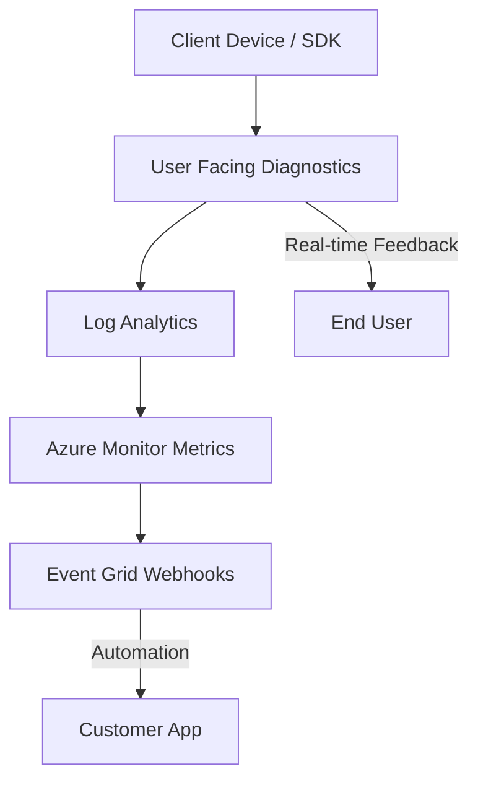

---
content_sources:
  - https://learn.microsoft.com/azure/communication-services/concepts/metrics
  - https://learn.microsoft.com/azure/azure-monitor/reference/tables/microsoft-communication-communicationservices
  - https://learn.microsoft.com/azure/azure-monitor/reference/tables/acssmsincomingoperations
  - https://learn.microsoft.com/azure/azure-monitor/reference/tables/acsemailstatusupdateoperational
  - https://learn.microsoft.com/azure/azure-monitor/reference/tables/acscalldiagnostics
---

# Detector Map

ACS diagnostic capabilities and how to use them for troubleshooting.

## ACS Diagnostic Architecture

ACS provides multiple layers of telemetry to help you understand service behavior and troubleshoot issues.

<!-- diagram-id: detector-architecture -->

## Diagnostic Capabilities

### 1. Azure Monitor Metrics
Metrics provide a high-level view of service health, error rates, and throughput.

* **ACS API request metrics**: Track request volume and error status by `Operation`, `Status Code`, and `StatusSubClass`.
* **SMS operations**: Filter API request metrics to SMS operations, then use `ACSSMSIncomingOperations` for transaction details.
* **Email operations**: Filter API request metrics to email send/status operations, then use email operational tables for delivery evidence.
* **Chat operations**: Filter API request metrics to chat operations, then use `ACSChatIncomingOperations.DurationMs` for operation latency.
* **Call quality**: Derive media quality from `ACSCallDiagnostics` fields such as `RoundTripTimeAvg`, `JitterAvg`, and `PacketLossRateAvg`.

### 2. Log Analytics Tables
Log Analytics provides transaction-level details, error codes, and request/response metadata.

| Table Name | Description |
| --- | --- |
| `ACSSMSIncomingOperations` | SMS operation outcomes, result codes, request duration, message identifiers. |
| `ACSEmailSendMailOperational` | Email send operations, recipient counts, message size, sender domain context. |
| `ACSEmailStatusUpdateOperational` | Email delivery status updates, SMTP codes, failure reason, bounce classification. |
| `ACSChatIncomingOperations` | Chat operation outcomes, duration, thread ID, user ID, status codes. |
| `ACSCallSummary` | Participant-level call summaries, duration, end reason, SDK and endpoint context. |
| `ACSCallDiagnostics` | Media stream diagnostics including round-trip time, jitter, packet loss, codec, and stream direction. |
| `ACSCallClientMediaStatsTimeSeries` | Client media statistics for granular calling quality analysis. |

### 3. Event Grid Events
Event Grid provides real-time webhooks for delivery reports, message events, and state changes.

* **Microsoft.Communication.SMSReceived**: Fired when a message is received.
* **Microsoft.Communication.SMSDeliveryReportReceived**: Fired when a delivery report is received.
* **Microsoft.Communication.ChatMessageReceived**: Fired when a chat message is received.
* **Microsoft.Communication.CallStarted / CallEnded**: Fired when a call session starts or ends.

### 4. Client-side User Facing Diagnostics (UFD)
UFD provides real-time feedback to the client app about network conditions and device issues.

* **network-quality**: Signal strength and network stability.
* **no-network**: Disconnection from the signaling service.
* **media-stream-dropped**: Loss of a specific audio or video stream.

## See Also
* [Evidence Map](../evidence-map.md)
* [Troubleshooting Methodology](troubleshooting-method.md)
* [KQL Query Library Overview](../kql/index.md)

## Sources
* [Enable logging with Azure Monitor](https://learn.microsoft.com/azure/communication-services/concepts/analytics/enable-logging)
* [ACS Metrics Reference](https://learn.microsoft.com/azure/communication-services/concepts/metrics)
* [ACS Log Analytics tables](https://learn.microsoft.com/azure/azure-monitor/reference/tables/microsoft-communication-communicationservices)
