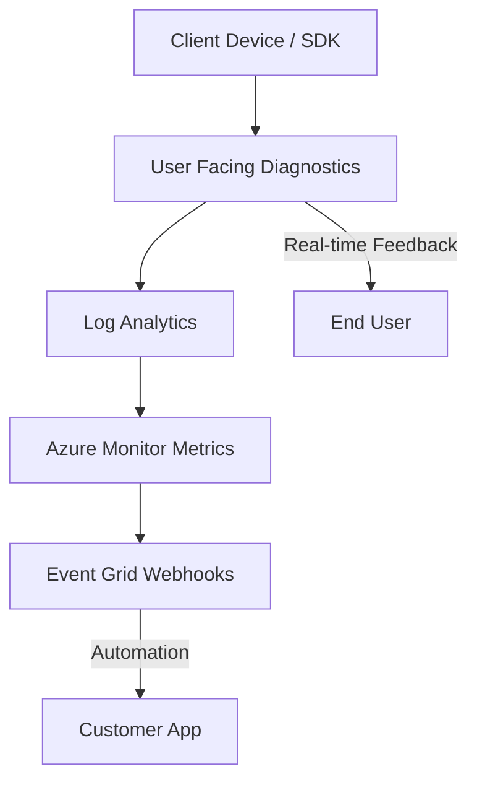

---
content_sources:
  diagrams:
    - id: detector-architecture
      type: flowchart
      source: self-generated
      justification: Original diagram of ACS diagnostic and detector capabilities across Azure Monitor and Log Analytics.
---

# Detector Map

ACS diagnostic capabilities and how to use them for troubleshooting.

## ACS Diagnostic Architecture

ACS provides multiple layers of telemetry to help you understand service behavior and troubleshoot issues.

<!-- diagram-id: detector-architecture -->

## Diagnostic Capabilities

### 1. Azure Monitor Metrics
Metrics provide a high-level view of service health, error rates, and throughput.

* **SMS API Requests**: Tracks SMS API call volume per operation. Split by the `Operation` dimension (`SMSMessageSent`, `SMSDeliveryReportsReceived`, `SMSMessagesReceived`) and filter by `Status Code` (for example `200`, `400`, `429`) or `StatusSubClass` (`2xx`, `4xx`, `5xx`) to monitor delivery success and throttling.
* **Email Service API Requests / Email Service Delivery Status Updates**: Track email send-side and lifecycle metrics. See [Monitoring → Email metrics](../../operations/monitoring.md) for the canonical metric names.
* **CallMediaStreamQuality**: Monitor latency, jitter, and packet loss for calls.
* **ChatMessageReceived / ChatMessageSent**: Track chat message volume and error rates.

### 2. Log Analytics Tables
Log Analytics provides transaction-level details, error codes, and request/response metadata.

| Table Name | Description |
| --- | --- |
| `ACSSMSIncomingOperations` | All SMS API operations (sends, delivery reports, inbound receives). Discriminate event types via `OperationName` (`SMSMessagesSent`, `SMSDeliveryReportsReceived`, `SMSMessagesReceived`). |
| `ACSEmailSendMailOperational` | One row per `SendEmail` API call (send-side metadata: correlation ID, recipient counts, size). |
| `ACSEmailStatusUpdateOperational` | Per-recipient delivery lifecycle transitions (`DeliveryStatus`, `SmtpStatusCode`, `IsHardBounce`). |
| `ACSEmailUserEngagementOperational` | Recipient open/click engagement events when tracking is enabled. |
| `ACSCallSummaryEvents` | Summary of each call, including start/end times and reasons. |
| `ACSCallDiagnosticsEvents` | Real-time diagnostic events for voice and video quality. |
| `ACSChatMessageReceivedEvents` | Details on each chat message received. |
| `ACSTeamsInteroperabilityEvents` | Details on Teams meeting interop activities. |

### 3. Event Grid Events
Event Grid provides real-time webhooks for delivery reports, message events, and state changes.

* **Microsoft.Communication.SMSReceived**: Fired when a message is received.
* **Microsoft.Communication.SMSDeliveryReportReceived**: Fired when a delivery report is received.
* **Microsoft.Communication.ChatMessageReceived**: Fired when a chat message is received.
* **Microsoft.Communication.CallStarted / CallEnded**: Fired when a call session starts or ends.

### 4. Client-side User Facing Diagnostics (UFD)
UFD provides real-time feedback to the client app about network conditions and device issues.

* **network-quality**: Signal strength and network stability.
* **no-network**: Disconnection from the signaling service.
* **media-stream-dropped**: Loss of a specific audio or video stream.

## See Also
* [Evidence Map](../evidence-map.md)
* [Troubleshooting Methodology](troubleshooting-method.md)
* [KQL Query Library Overview](../kql/index.md)

## Sources
* [ACS Diagnostic Logs Documentation](https://learn.microsoft.com/en-us/azure/communication-services/concepts/analytics/diagnostic-logging)
* Azure Monitor for Communication Services Overview
