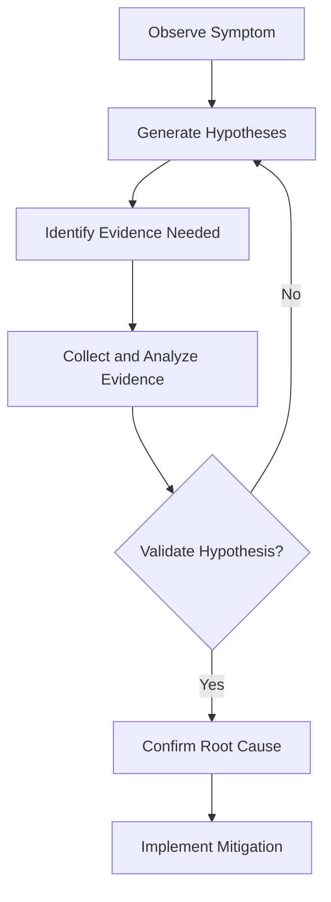

---
content_sources:
  - azure-paas-methodology
  - troubleshooting-framework
content_validation:
  status: pending_review
  last_reviewed: null
  reviewer: agent
  core_claims: []
---

# Troubleshooting Methodology

This guide provides a deep-dive into the hypothesis-driven troubleshooting approach used throughout this practical guide.

## The Hypothesis-Driven Approach

Instead of random searching, we use a structured process to isolate root causes.

<!-- diagram-id: methodology-flow -->

## Evidence Collection Framework

We categorize evidence based on its reliability and directness.

| Tag | Level | Description |
| --- | --- | --- |
| **[Observed]** | Direct | Directly seen in logs or error messages (e.g., `401 Unauthorized`). |
| **[Measured]** | Quantitative | Quantitatively confirmed by metrics (e.g., `99.9% packet loss`). |
| **[Correlated]** | Statistical | Two signals move together (e.g., `Latency spikes during high CPU`). |
| **[Inferred]** | Logical | A reasonable conclusion based on surrounding evidence. |
| **[Strongly Suggested]** | Probable | High probability, but not definitive. |
| **[Not Proven]** | Uncertain | Tested but not confirmed. |

## Layered Diagnosis

Troubleshooting should proceed logically through the communication layers:

1. **Client/SDK**: Device issues, token expiry, initialization errors.
2. **Network**: Firewall, proxy, NAT, bandwidth, jitter.
3. **Service (Azure)**: ACS resource limits, regional issues, global service health.
4. **Handoff (Carrier/Recipient)**: Downstream delivery status, recipient policies.

## Best Practices

* **Isolate Variables**: Change one thing at a time when testing a hypothesis.
* **Reproduction**: Try to reproduce the issue in a controlled environment.
* **Document Everything**: Keep a record of the evidence collected and the hypotheses tested.
* **Automate Alerts**: Use Azure Monitor to alert on critical failure patterns before they become major incidents.

## See Also
* [Detector Map](detector-map.md)
* [Evidence Map](../evidence-map.md)
* [Mental Model](../mental-model.md)

## Sources
* Azure PaaS Troubleshooting Methodology
* SRE Incident Management Best Practices
