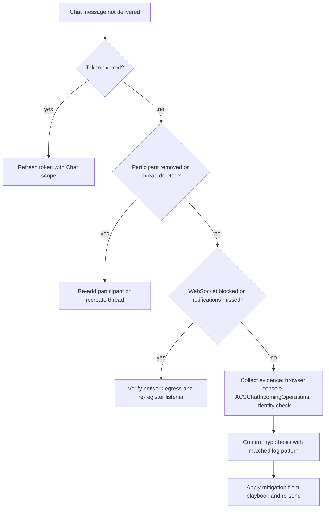

---
content_sources:
  diagrams:
    - id: chat-delivery-hypothesis-flow
      type: flowchart
      source: self-generated
      justification: Visualizes this playbook's hypothesis triage and evidence-collection sequence, synthesized from the playbook content below.
content_validation:
  status: verified
  last_reviewed: 2026-07-25
  reviewer: agent
  core_claims:
    - claim: "ACS chat sessions use Communication Identity access tokens, so message-delivery investigations must check whether the token is valid for the user session"
      source: https://learn.microsoft.com/en-us/azure/communication-services/concepts/identity-model
      verified: true
    - claim: "ACS Chat provides real-time messaging capabilities, which is why delivery investigations must consider thread membership and the real-time notification path instead of treating chat like store-and-forward email"
      source: https://learn.microsoft.com/en-us/azure/communication-services/concepts/chat/concepts
      verified: true
---

# Chat Message Delivery Playbook

**Symptom**: Chat messages not arriving at the recipient's device.

## Hypotheses

| Hypothesis | Likely Cause | Evidence Tag |
| --- | --- | --- |
| Token expired | The user's access token is no longer valid for the session | [Observed] |
| Participant removed | The user was removed from the chat thread and can no longer receive messages | [Measured] |
| Thread deleted | The entire chat thread was deleted by an admin or another participant | [Observed] |
| Network issue | Firewall or local proxy is blocking the WebSocket connection | [Correlated] |
| Missing notifications | The app is not correctly listening for real-time notification events | [Inferred] |

<!-- diagram-id: chat-delivery-hypothesis-flow -->


## Evidence Collection

### 1. Browser Console
Look for `401 Unauthorized`, `403 Forbidden`, or `404 Not Found` errors in the developer tools.

### 2. Log Analytics
Query the `ACSChatMessageSentEvents` and `ACSChatMessageReceivedEvents` tables.

### 3. Identity Verification
Confirm the user's communication identity still exists.

```bash
az communication user-identity token issue --scope chat --connection-string "<cs>"
```

| Command | Purpose |
|---------|---------|
| `az communication user-identity token issue` | Issues a new access token to validate chat token issuance and connectivity. |
| `--scope chat` | Requests the `chat` scope required for chat operations. |
| `--connection-string "<cs>"` | Authenticates the request using the ACS connection string. |

## Validation

### [Observed] Check Token Expiration
Verify if the token was generated more than 24 hours ago. If so, a new token must be requested and provided to the Chat Client.

### [Measured] Validate Thread Membership
Retrieve the list of participants for the thread ID. If the user is not listed, they will not receive notifications for that thread.

### [Correlated] Identify WebSocket Blockage
If the client can send messages but cannot receive them, check if the WebSocket connection to `*.communication.azure.com` is established or interrupted by a firewall.

## Mitigation

1. **Refresh Access Tokens**: Implement a proactive token refresh mechanism in your client app before the token expires.
2. **Handle Membership Events**: Subscribe to thread-level events to update the UI when a user is added or removed.
3. **Check Connection Health**: Use a heartbeat or connection state listener to detect and recover from WebSocket disconnection.
4. **Cleanse Deleted Threads**: Update your local state when a thread is deleted to prevent sending to a non-existent resource.

## See Also
* [Thread Management](thread-management.md)
* [Real-time Notifications](real-time-notifications.md)

## Sources
* Azure Communication Services Chat SDK Troubleshooting
* Real-time Messaging Network Requirements
