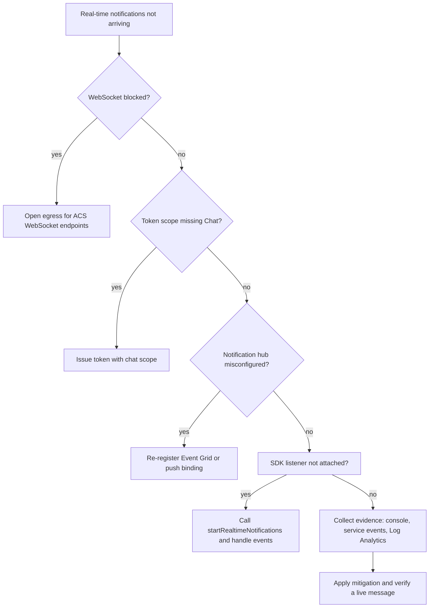

---
content_sources:
  diagrams:
    - id: chat-notifications-hypothesis-flow
      type: flowchart
      source: self-generated
      justification: Visualizes this playbook's hypothesis triage and evidence-collection sequence, synthesized from the playbook content below.
content_validation:
  status: verified
  last_reviewed: 2026-07-25
  reviewer: agent
  core_claims:
    - claim: "ACS Chat includes real-time messaging capabilities, so notification failures can occur even when the underlying thread and identity objects still exist"
      source: https://learn.microsoft.com/en-us/azure/communication-services/concepts/chat/concepts
      verified: true
    - claim: "Communication Identity access tokens are required for chat clients, which makes token issuance and refresh part of the notification troubleshooting surface"
      source: https://learn.microsoft.com/en-us/azure/communication-services/concepts/identity-model
      verified: true
---

# Real-time Notifications Playbook

**Symptom**: Real-time notifications not working in the chat app.

## Hypotheses

| Hypothesis | Likely Cause | Evidence Tag |
| --- | --- | --- |
| WebSocket blocked | Local firewall or proxy is blocking the WebSocket connection | [Measured] |
| Token scope missing | The user's token does not have the `chat` scope | [Observed] |
| Notification hub misconfigured | The Azure Notification Hub or Firebase configuration is incorrect | [Correlated] |
| SDK not listening | The app has not correctly registered for the `chatMessageReceived` event | [Inferred] |

<!-- diagram-id: chat-notifications-hypothesis-flow -->

## Evidence Collection

### 1. Browser Console
Check for `WebSocket` connection failures or `401 Unauthorized` errors.

### 2. Service-to-Service Events
Monitor the `Microsoft.Communication.ChatMessageReceived` events in Event Grid.

### 3. Log Analytics
Query the `ACSChatMessageReceivedEvents` table.

## Validation

### [Measured] Test WebSocket Connectivity
Ensure the client can connect to `*.communication.azure.com` over port `443`. If the connection fails, real-time events will not arrive.

### [Observed] Validate Token Scopes
Ensure the identity token was generated with the `chat` scope. Without it, real-time event subscription will fail.

### [Correlated] Identify Hub Misconfiguration
If using push notifications (e.g., via FCM or APNs), verify the ACS resource is correctly linked to the Notification Hub and the credentials are valid.

## Mitigation

1. **Allow WebSocket Traffic**: Ensure that the client's firewall and proxy allow traffic to the required ACS endpoints.
2. **Assign Correct Scopes**: Always include the `chat` scope when generating tokens for users who need real-time notifications.
3. **Register for Events**: Double-check the SDK code to ensure the `startRealtimeNotifications()` method is called and event handlers are registered correctly.
4. **Update Push Config**: Regularly verify and update the FCM/APNs credentials in the linked Notification Hub to prevent notification delivery failures.

## See Also
* [Message Delivery](message-delivery.md)
* [Thread Management](thread-management.md)

## Sources
* Azure Communication Services Real-time Notifications Documentation
* WebSocket Connectivity for Real-time Media
