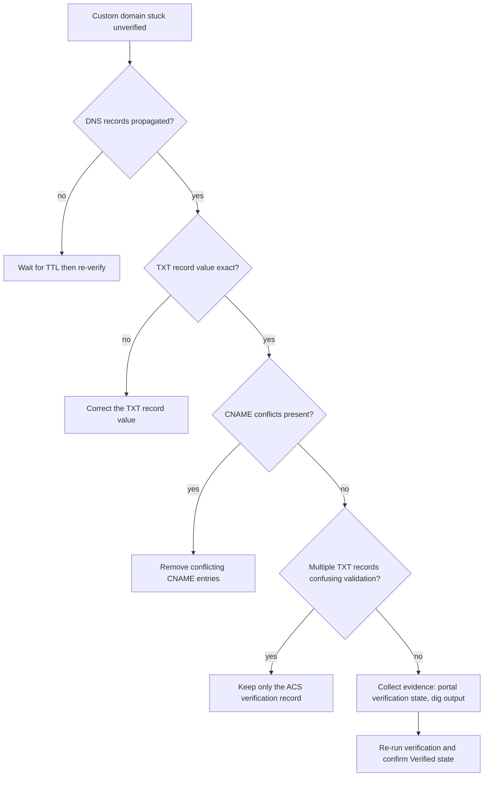

---
content_sources:
  diagrams:
    - id: email-domain-verification-flow
      type: flowchart
      source: mslearn-adapted
      based_on:
        - https://learn.microsoft.com/en-us/azure/communication-services/concepts/email/domain-verification

content_validation:
  status: verified
  last_reviewed: 2026-07-25
  reviewer: agent
  core_claims:
    - claim: "ACS custom email domains require DNS-based verification records before they can be used for sending"
      source: https://learn.microsoft.com/en-us/azure/communication-services/quickstarts/email/add-custom-verified-domains
      verified: true
    - claim: "ACS sender authentication guidance documents the outbound-domain verification model, including records such as SPF and DKIM, for custom-domain email sending"
      source: https://learn.microsoft.com/en-us/azure/communication-services/concepts/email/email-domain-and-sender-authentication
      verified: true
---

# Domain Verification Playbook

**Symptom**: Domain verification failing or stuck in `Pending`.

## Hypotheses

| Hypothesis | Likely Cause | Evidence Tag |
| --- | --- | --- |
| DNS records not propagated | Records were added but have not yet propagated globally | [Observed] |
| Wrong TXT record | The TXT record value was copied incorrectly from the Azure portal | [Measured] |
| CNAME conflicts | Existing records at the same domain level are conflicting with the verification records | [Correlated] |
| Multiple TXT records | Multiple SPF TXT records are present at the domain root | [Inferred] |

<!-- diagram-id: email-domain-verification-flow -->


## Evidence Collection

### 1. Azure Portal
Check the `Email Services` section of your ACS resource.

### 2. DNS Lookup (dig/nslookup)
Verify records manually using the command line.

```bash
# Verify SPF record
dig txt yourdomain.com

# Verify DKIM record
dig cname selector1._domainkey.yourdomain.com
```

### 3. Check Propagation
Use a tool like `dnschecker.org` to verify records globally.

## Validation

### [Observed] Track Propagation Time
DNS propagation can take up to 24-48 hours. If the record was added recently, wait and retry verification in the portal.

### [Measured] Verify TXT Record Value
Ensure the TXT record starts with `v=spf1 include:spf.communication.azure.com ~all` and matches the exact value provided in the portal.

### [Correlated] Identify CNAME Conflicts
If you're using a CNAME for the root domain (not recommended), it may conflict with other record types. Use a subdomain (e.g., `mail.yourdomain.com`) instead.

## Step-by-Step Verification Procedure

1. **Obtain Records**: Go to the Azure Portal, select your Email Service, and click **Setup**.
2. **Add Records**: Add the provided TXT (SPF), CNAME (DKIM), and TXT (DMARC) records to your DNS provider's control panel.
3. **Verify Local Records**: Use `nslookup -q=txt yourdomain.com` to confirm the records appear.
4. **Trigger Verification**: In the Azure Portal, click **Verify** for each record.
5. **Check Status**: Ensure all records show a green checkmark and the domain status is `Verified`.

## See Also
* [Email Delivery Failures](delivery-failures.md)
* [Spam Filtering](spam-filtering.md)

## Sources
* [ACS Email Domain Verification Documentation](https://learn.microsoft.com/en-us/azure/communication-services/concepts/email/domain-verification)
* Common DNS Troubleshooting Techniques
