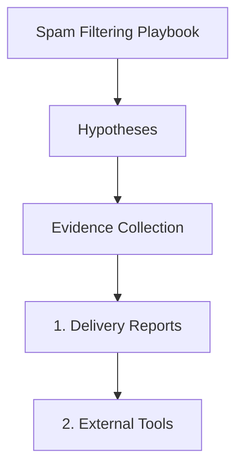

---
content_sources:
  sources:
  - type: mslearn-adapted
    url: azure-docs
  - type: mslearn-adapted
    url: email-reputation-guide
  diagrams:
  - id: spam-filtering-page-flow
    type: flowchart
    source: self-generated
    justification: Synthesized from the page structure and Microsoft Learn sources
      listed in this document.
    based_on:
    - https://learn.microsoft.com/en-us/azure/communication-services/overview
content_validation:
  status: pending_review
  last_reviewed: null
  reviewer: agent
  core_claims: []
---
# Spam Filtering Playbook

**Symptom**: Emails landing in spam folders.

## Hypotheses

| Hypothesis | Likely Cause | Evidence Tag |
| --- | --- | --- |
| Missing DMARC | Lack of DMARC policy makes emails look suspicious to major providers | [Measured] |
| Content triggers | Subject lines or body text contain common spam keywords | [Inferred] |
| IP reputation | The ACS outbound IP address is on a blocklist | [Correlated] |
| Warm-up needed | Sudden high volume from a new domain triggers spam filters | [Observed] |

## Evidence Collection

### 1. Delivery Reports
Check for `Reason` codes in Log Analytics mentioning `Spam` or `Junk`.

### 2. External Tools
Use `mxtoolbox.com` to check if your domain or IP is on any major blocklists.

### 3. Mail-Tester
Send a test email to `mail-tester.com` to get a detailed spam score.

## Validation

### [Measured] Monitor DMARC Status
Verify that a DMARC TXT record exists (e.g., `v=DMARC1; p=none;`). Most major providers (Gmail, Outlook) now require DMARC for improved deliverability.

### [Inferred] Check Content Keywords
Identify if the email subject or body contains phrases like "ACT NOW", "FREE", or multiple exclamation marks.

### [Correlated] Review IP Reputation
If multiple clients are reporting spam from your domain, check if the outbound ACS IP range has been flagged.

## Mitigation

1. **Implement DMARC**: Add a DMARC policy to your DNS (start with `p=none` and move to `p=quarantine`).
2. **Improve Content**: Avoid spammy language and use professional templates with a clear sender name.
3. **Warm-up Domain**: Gradually increase sending volume over several weeks to build reputation.
4. **Use Subdomains**: Use a separate subdomain (e.g., `info.yourdomain.com`) for marketing emails to protect your root domain's reputation.
5. **Monitor Feedback Loops**: Subscribe to feedback loops from major providers to identify and remove users who flag your emails as spam.

## Page Flow

<!-- diagram-id: spam-filtering-page-flow -->

## See Also
* [Email Delivery Failures](delivery-failures.md)
* [Domain Verification](domain-verification.md)

## Sources
* Azure Communication Services Email Deliverability Best Practices
* Sender Policy Framework (SPF) and DomainKeys Identified Mail (DKIM)
