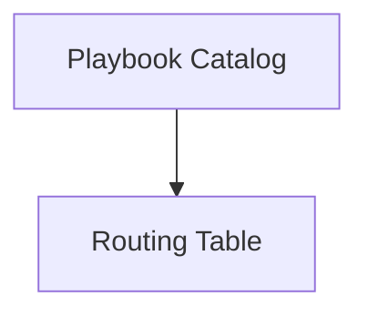

---
content_sources:
  sources:
  - type: mslearn-adapted
    url: azure-docs
  - type: mslearn-adapted
    url: communication-services-playbooks
  diagrams:
  - id: index-page-flow
    type: flowchart
    source: self-generated
    justification: Synthesized from the page structure and Microsoft Learn sources
      listed in this document.
    based_on:
    - https://learn.microsoft.com/en-us/azure/communication-services/overview
content_validation:
  status: pending_review
  last_reviewed: null
  reviewer: agent
  core_claims: []
---
# Playbook Catalog

A collection of guided troubleshooting procedures for common ACS failures.

## Routing Table

| Channel | Symptom | Playbook |
| --- | --- | --- |
| **SMS** | SMS not delivered | [SMS Delivery Failures](sms/delivery-failures.md) |
| **SMS** | Opt-out/in issues | [Opt-out Handling](sms/opt-out-handling.md) |
| **SMS** | Throttling/429 errors | [Rate Limiting](sms/rate-limiting.md) |
| **Email** | Email not delivered | [Email Delivery Failures](email/delivery-failures.md) |
| **Email** | Verification failing | [Domain Verification](email/domain-verification.md) |
| **Email** | Landing in spam | [Spam Filtering](email/spam-filtering.md) |
| **Chat** | Messages not arriving | [Message Delivery](chat/message-delivery.md) |
| **Chat** | Thread issues | [Thread Management](chat/thread-management.md) |
| **Chat** | Notification failures | [Real-time Notifications](chat/real-time-notifications.md) |
| **Voice/Video** | Poor quality | [Call Quality](voice-video/call-quality.md) |
| **Voice/Video** | Calls disconnecting | [Call Drops](voice-video/call-drops.md) |
| **Voice/Video** | Connection failing | [Connection Failures](voice-video/oode-quality.md) |
| **Teams Interop** | Join failures | [Teams Join Failures](teams-interop/join-failures.md) |
| **Teams Interop** | Functionality issues | [Teams Permission Issues](teams-interop/permission-issues.md) |

## Page Flow

<!-- diagram-id: index-page-flow -->

## See Also
* [First 10 Minutes](../first-10-minutes/index.md)
* [Decision Tree](../decision-tree.md)
* [Evidence Map](../evidence-map.md)

## Sources

- [Microsoft Learn source 1](https://learn.microsoft.com/en-us/azure/communication-services/overview)
