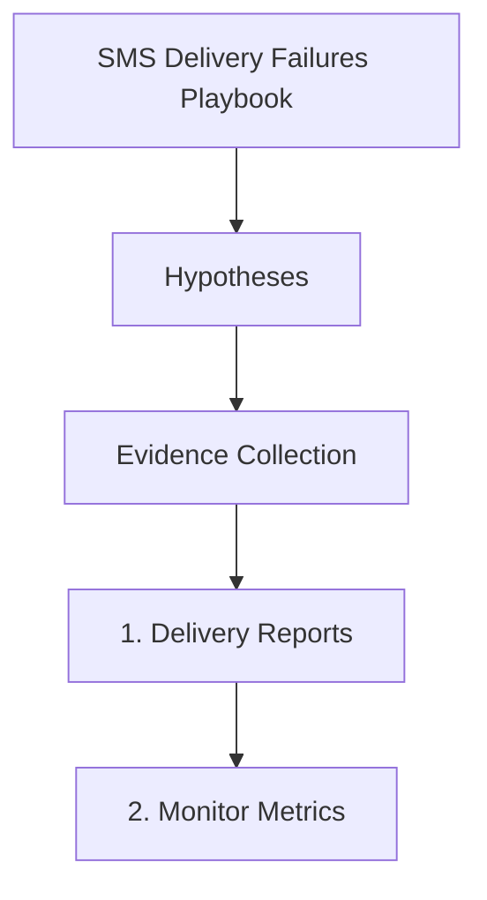

---
content_sources:
  sources:
  - type: mslearn-adapted
    url: https://learn.microsoft.com/azure/communication-services/concepts/service-limits
  - type: mslearn-adapted
    url: https://learn.microsoft.com/azure/communication-services/concepts/analytics/logs/sms-logs
  - type: mslearn-adapted
    url: https://learn.microsoft.com/en-us/azure/azure-monitor/reference/acssmsincomingoperations
  diagrams:
  - id: delivery-failures-page-flow
    type: flowchart
    source: self-generated
    justification: Synthesized from the page structure and Microsoft Learn sources
      listed in this document.
    based_on:
    - https://learn.microsoft.com/azure/communication-services/concepts/service-limits
content_validation:
  status: pending_review
  last_reviewed: null
  reviewer: agent
  core_claims: []
---
# SMS Delivery Failures Playbook

**Symptom**: SMS not delivered to recipient.

## Hypotheses

| Hypothesis | Likely Cause | Evidence Tag |
| --- | --- | --- |
| Wrong phone format | Number not in E.164 format (e.g., missing `+1`) | [Observed] |
| Recipient opt-out | Recipient is on a STOP list or has previously opted out | [Inferred] |
| Carrier blocking | Content triggered spam filters or suspicious pattern detection | [Correlated] |
| Rate limiting | Exceeding the messages per second (MPS) limit for the number | [Measured] |
| Invalid number | Destination number is disconnected or does not exist | [Observed] |

## Evidence Collection

### 1. Delivery Reports
Check `ACSSMSIncomingOperations` in Log Analytics for SMS operation outcomes, result codes, and message IDs.

### 2. Monitor Metrics
Review ACS API request metrics filtered to SMS operations and status dimensions. Do not rely on undocumented metric names such as `SmsMessagesDelivered`.

### 3. CLI Check
Use the CLI to get the status of a specific message ID.

```bash
az communication sms get-delivery-report --message-id "<id>" --connection-string "<cs>"
```

## Validation

### [Observed] Validate Phone Format
Ensure the number starts with `+` followed by the country code. If not, the SDK or service will reject the request with a `400 Bad Request`.

### [Inferred] Check Opt-out Status
Review recipient communication history. If they sent a `STOP` keyword, the carrier will block future messages.

### [Measured] Review MPS Throttling
Check for `429 Too Many Requests` in your app logs. Azure Monitor will show spikes in throttled requests.

## Mitigation

1. **Fix Format**: Normalize all phone numbers to E.164 before sending.
2. **Handle Opt-outs**: Respect STOP keywords and implement a local suppression list.
3. **Optimize Content**: Avoid short-links and suspicious keywords. Use a consistent sender name.
4. **Scale Throughput**: If hitting rate limits, request a higher MPS limit or use a toll-free number.

## Page Flow

<!-- diagram-id: delivery-failures-page-flow -->


## See Also
* [SMS Opt-out Handling](opt-out-handling.md)
* [SMS Rate Limiting](rate-limiting.md)

## Sources
* [ACS service limits](https://learn.microsoft.com/azure/communication-services/concepts/service-limits)
* [SMS logs](https://learn.microsoft.com/azure/communication-services/concepts/analytics/logs/sms-logs)
* [ACSSMSIncomingOperations table](https://learn.microsoft.com/en-us/azure/azure-monitor/reference/acssmsincomingoperations)
