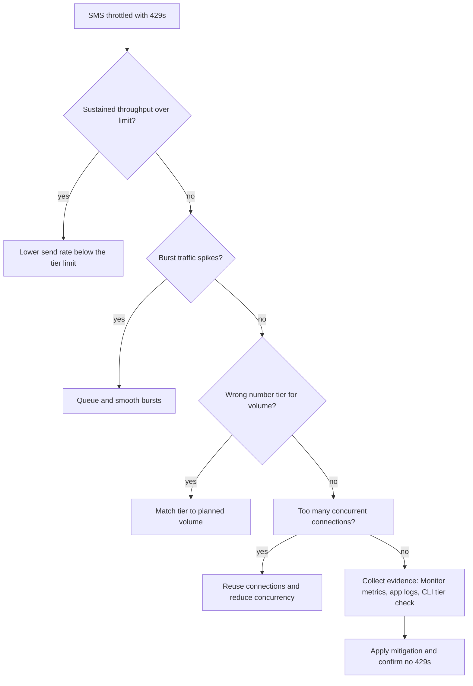

---
content_sources:
  diagrams:
    - id: sms-ratelimit-hypothesis-flow
      type: flowchart
      source: mslearn-adapted
      based_on:
        - https://learn.microsoft.com/en-us/azure/communication-services/concepts/service-limits#sms
        - https://learn.microsoft.com/en-us/azure/communication-services/concepts/sms/sms-faq#character-and-rate-limits

content_validation:
  status: verified
  last_reviewed: 2026-07-25
  reviewer: agent
  core_claims:
    - claim: "ACS documents SMS rate and service limits, so 429 or throughput-related symptoms should be evaluated against the published limits for the number type and scenario"
      source: https://learn.microsoft.com/en-us/azure/communication-services/concepts/sms/sms-faq
      verified: true
    - claim: "SMS segmentation and encoding affect how ACS counts and bills SMS payloads, which is relevant when rate-limiting symptoms correlate with long or non-GSM messages"
      source: https://learn.microsoft.com/en-us/azure/communication-services/concepts/sms/sms-faq
      verified: true
---

# SMS Rate Limiting Playbook

**Symptom**: SMS sending throttled or failing with `429 Too Many Requests`.

## Hypotheses

| Hypothesis | Likely Cause | Evidence Tag |
| --- | --- | --- |
| Exceeded throughput | The sender exceeded its documented 60-second send window | [Measured] |
| Burst traffic | A sudden spike in sending volume beyond the burst capacity | [Observed] |
| Wrong tier | Using a free or basic tier with lower throughput than required | [Correlated] |
| Concurrent connections | Too many parallel requests to the ACS endpoint from the client app | [Inferred] |

<!-- diagram-id: sms-ratelimit-hypothesis-flow -->


## Evidence Collection

### 1. Azure Monitor Metrics
Split the `SMS API Requests` metric by the `Operation` dimension (filter to `SMSMessageSent`) and filter by `Status Code` (`429`) to isolate throttled send requests. Per-row evidence lives in Log Analytics: `ACSSMSIncomingOperations | where OperationName == "SMSMessagesSent" and ResultSignature == 429`.

### 2. App Logs
Look for `429 Too Many Requests` in your application logs or HTTP traces.

### 3. CLI Check
Verify current number and its tier.

```bash
az communication phonenumber list --connection-string "<cs>"
```

| Command | Purpose |
|---------|---------|
| `az communication phonenumber list` | Lists the phone numbers provisioned on the ACS resource. |
| `--connection-string "<cs>"` | Authenticates the request using the ACS connection string. |

## Validation

### [Measured] Monitor Throughput
Count rows in `ACSSMSIncomingOperations` where `OperationName == "SMSMessagesSent"` per `PhoneNumber` over a 60-second bin (ACS rate limits are documented per 60-second window, not per second). Per Microsoft Learn service limits, toll-free numbers allow 200 send requests per 60 seconds per number (~3.33 messages/sec average), short codes allow 6,000 per 60 seconds per number (100 messages/sec average), and alphanumeric sender IDs allow 600 per 60 seconds per resource. If the count in a 60-second bin exceeds these limits, the service throttles and you will see `ResultSignature == 429` on the affected rows.

### [Observed] Track Burst Traffic
Identify if the `429` errors occur only during high-volume events (e.g., promotional campaigns or mass notifications).

### [Correlated] Review Number Type
A local long code (10DLC) number has lower MPS than a toll-free number or a short code. Match your sending volume to the number's capacity.

## Mitigation

1. **Implement Exponential Backoff**: When a `429` error is received, wait and retry the request after a short delay.
2. **Queuing and Buffering**: Implement a message queue (e.g., Azure Service Bus or RabbitMQ) to smooth out sending spikes and stay within the documented 60-second send window.
3. **Upgrade Number Type**: If higher throughput is required, move from a local 10DLC number to a toll-free number (200 requests per 60 seconds per number) or a short code (6,000 requests per 60 seconds per number). For 10DLC daily caps by carrier and vetting tier, see the [SMS FAQ 10DLC rate limits table](https://learn.microsoft.com/en-us/azure/communication-services/concepts/sms/sms-faq#rate-limits-for-10dlc).
4. **Distribute Traffic**: Use multiple phone numbers (number pooling) to distribute the sending load. Note that this requires Careful coordination to avoid carrier-level filtering.

## See Also
* [SMS Delivery Failures](delivery-failures.md)
* [SMS Opt-out Handling](opt-out-handling.md)

## Sources
* [ACS SMS Service Limits](https://learn.microsoft.com/en-us/azure/communication-services/concepts/service-limits#sms)
* [SMS FAQ — Character and rate limits](https://learn.microsoft.com/en-us/azure/communication-services/concepts/sms/sms-faq#character-and-rate-limits)
* [Throttling pattern (Azure Architecture Center)](https://learn.microsoft.com/en-us/azure/architecture/patterns/throttling)
