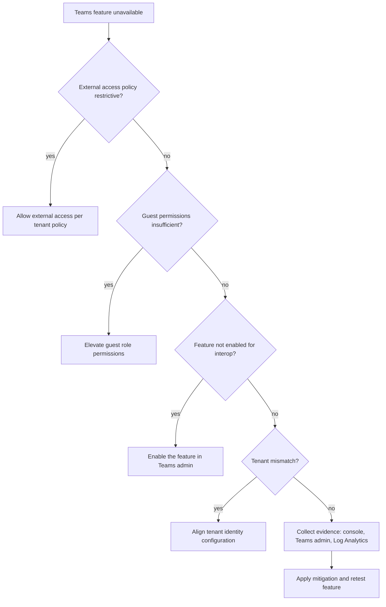

---
content_sources:
  diagrams:
    - id: teams-permissions-hypothesis-flow
      type: flowchart
      source: mslearn-adapted
      based_on:
        - https://learn.microsoft.com/en-us/azure/communication-services/concepts/voice-video-calling/teams-interop#feature-support

content_validation:
  status: verified
  last_reviewed: 2026-07-25
  reviewer: agent
  core_claims:
    - claim: "Teams interop scenarios have documented feature-support boundaries, so permission investigations must first confirm the requested feature is supported in the interop path"
      source: https://learn.microsoft.com/en-us/azure/communication-services/concepts/voice-video-calling/teams-interop#feature-support
      verified: true
    - claim: "ACS Teams interop is a documented capability rather than a generic SIP bridge, so tenant policy and supported-scenario checks are part of permission troubleshooting"
      source: https://learn.microsoft.com/en-us/azure/communication-services/concepts/teams-interop
      verified: true
---

# Teams Permission Issues Playbook

**Symptom**: Limited functionality in a Teams meeting (e.g., cannot share screen, cannot chat).

## Hypotheses

| Hypothesis | Likely Cause | Evidence Tag |
| --- | --- | --- |
| External access policy | The Teams admin has restricted features for external users | [Measured] |
| Guest permissions | The user's role in the meeting (e.g., attendee) has restricted permissions | [Observed] |
| Feature not enabled | The ACS application does not have the required feature enabled for Teams interop | [Correlated] |
| Tenant mismatch | The user's identity is from a different tenant than the Teams meeting | [Inferred] |

<!-- diagram-id: teams-permissions-hypothesis-flow -->

## Evidence Collection

### 1. Browser Console
Look for `403 Forbidden` errors with a specific feature-related error code (e.g., `feature-not-supported`).

### 2. Teams Admin Center
Check for meeting policies and feature-specific settings for guests and external users.

### 3. SDK Log Analytics
Query the `ACSTeamsInteroperabilityEvents` table.

## Validation

### [Measured] Review Feature Policy
Ensure that "Screen sharing" and "Chat" are enabled for guests and external users in the Teams Admin Center. If disabled, these features will not be available in ACS.

### [Observed] Validate Meeting Role
Verify that the user has been given a role with the required permissions (e.g., `Presenter` vs `Attendee`). Attendees in Teams meetings often have restricted features.

### [Correlated] Identify Feature Support
Check the ACS SDK documentation to ensure the specific feature (e.g., live captions) is supported in Teams interoperability mode.

## Mitigation

1. **Enable Feature Policies**: Work with the Teams admin to enable the required feature policies for guests and external users.
2. **Promote User Role**: If a user needs more permissions (like screen sharing), the meeting organizer can promote them to `Presenter`.
3. **Verify Feature Support**: Ensure the feature you are trying to use is supported by the ACS SDK and Teams interoperability.
4. **Handle Mismatch**: If there's a tenant mismatch, verify that both tenants have the required trust and policy settings enabled.
5. **Update SDK Version**: Ensure you are using the latest version of the ACS Calling SDK, as feature support for Teams interop is frequently updated.

## See Also
* [Teams Join Failures](join-failures.md)
* [Call Quality](../voice-video/call-quality.md)

## Sources
* [ACS Teams Interoperability Feature Support](https://learn.microsoft.com/en-us/azure/communication-services/concepts/voice-video-calling/teams-interop#feature-support)
* Teams Meeting Policies and Permissions
