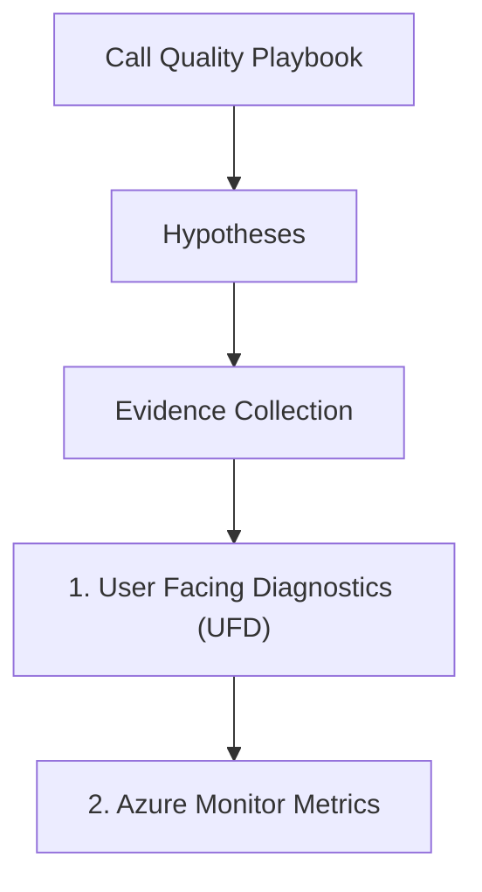

---
content_sources:
  sources:
  - type: mslearn-adapted
    url: https://learn.microsoft.com/azure/communication-services/concepts/voice-video-calling/user-facing-diagnostics
  - type: mslearn-adapted
    url: https://learn.microsoft.com/azure/communication-services/concepts/analytics/logs/voice-and-video-logs
  - type: mslearn-adapted
    url: https://learn.microsoft.com/en-us/azure/azure-monitor/reference/acscalldiagnostics
  diagrams:
  - id: call-quality-page-flow
    type: flowchart
    source: self-generated
    justification: Synthesized from the page structure and Microsoft Learn sources
      listed in this document.
    based_on:
    - https://learn.microsoft.com/azure/communication-services/concepts/voice-video-calling/user-facing-diagnostics
content_validation:
  status: pending_review
  last_reviewed: null
  reviewer: agent
  core_claims: []
---
# Call Quality Playbook

**Symptom**: Poor audio/video quality during a call (jitter, lag, or distortion).

## Hypotheses

| Hypothesis | Likely Cause | Evidence Tag |
| --- | --- | --- |
| Bandwidth insufficient | Local network bandwidth is too low for the required bitrate | [Measured] |
| TURN blocked | UDP media traffic is blocked, forcing lower quality TCP fallback | [Observed] |
| Codec mismatch | The client or receiver is using an inefficient or unsupported codec | [Correlated] |
| Network jitter | High variability in packet delivery times causing audio artifacts | [Measured] |
| Device overload | High CPU or memory usage on the client's device | [Inferred] |

## Evidence Collection

### 1. User Facing Diagnostics (UFD)
Review the logs for `network-quality`, `bad-network`, or `media-stream-dropped` signals.

### 2. Azure Monitor Metrics
Use ACS API request metrics for request success/error status. Derive media quality from `ACSCallDiagnostics`; do not use undocumented metric names such as `CallMediaStreamQuality`.

### 3. Log Analytics
Query the `ACSCallDiagnostics` table.

## Validation

### [Measured] Monitor Bandwidth and Packet Loss
Check if the average packet loss exceeds 1-2% or if the latency is greater than 200ms. These are common thresholds for poor quality.

### [Observed] Validate TURN/STUN Accessibility
Verify that the client can establish a UDP connection for media. If blocked, the SDK will attempt a TCP relay, which is more prone to lag and jitter.

### [Correlated] Identify Codec Mismatch
Check the `CodecName` in `ACSCallDiagnostics`. If the browser or device does not support H.264, it may fallback to an older, lower-quality codec.

## Mitigation

1. **Enable UFD**: Use User Facing Diagnostics to inform the user when their network or device is causing poor quality.
2. **Optimize Media Path**: Ensure the client's firewall and proxy allow traffic to the required ACS UDP ports.
3. **Use Adaptive Bitrate**: The ACS SDK automatically adjusts bitrate based on network conditions. Ensure this feature is not disabled or restricted.
4. **Reduce Device Load**: Advise the user to close other high-resource applications or browsers during the call.
5. **Lower Video Resolution**: If bandwidth is limited, the app can programmatically lower the video resolution to prioritize audio quality.

## Page Flow

<!-- diagram-id: call-quality-page-flow -->

## See Also
* [Call Drops](call-drops.md)
* [Connection Failures](oode-quality.md)

## Sources
* [User Facing Diagnostics](https://learn.microsoft.com/azure/communication-services/concepts/voice-video-calling/user-facing-diagnostics)
* [Voice and video call logs](https://learn.microsoft.com/azure/communication-services/concepts/analytics/logs/voice-and-video-logs)
* [ACSCallDiagnostics table](https://learn.microsoft.com/en-us/azure/azure-monitor/reference/acscalldiagnostics)
