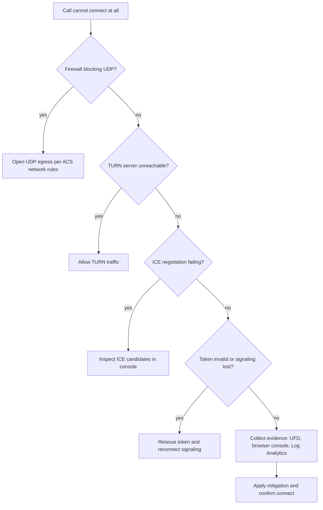

---
content_sources:
  diagrams:
    - id: oode-connection-hypothesis-flow
      type: flowchart
      source: self-generated
      justification: Visualizes this playbook's hypothesis triage and evidence-collection sequence, synthesized from the playbook content below.
content_validation:
  status: verified
  last_reviewed: 2026-07-25
  reviewer: agent
  core_claims:
    - claim: "Voice and video workloads depend on the documented ACS calling network requirements, so connection-failure troubleshooting starts with required endpoints, transports, and firewall allowances"
      source: https://learn.microsoft.com/en-us/azure/communication-services/concepts/voice-video-calling/network-requirements
      verified: true
    - claim: "User Facing Diagnostics can surface client-side connection and device issues, which makes it a first-line evidence source for call-setup failures"
      source: https://learn.microsoft.com/en-us/azure/communication-services/concepts/voice-video-calling/user-facing-diagnostics
      verified: true
---

# Connection Failures Playbook

**Symptom**: Cannot establish a call connection.

## Hypotheses

| Hypothesis | Likely Cause | Evidence Tag |
| --- | --- | --- |
| Firewall blocking UDP | Media traffic is blocked by a network firewall or proxy | [Measured] |
| TURN server unreachable | The client cannot connect to the Azure TURN/STUN relay | [Observed] |
| ICE negotiation failure | Interactive Connectivity Establishment (ICE) failed to find a valid media path | [Correlated] |
| Invalid token | The user's access token is invalid or does not have the `voip` scope | [Observed] |
| Signaling connection lost | The WebSocket connection for call signaling could not be established | [Inferred] |

<!-- diagram-id: oode-connection-hypothesis-flow -->

## Evidence Collection

### 1. User Facing Diagnostics (UFD)
Look for `call-start-failed`, `media-connection-failed`, or `ice-negotiation-failed` signals.

### 2. Browser Console
Look for `401 Unauthorized` or `403 Forbidden` errors on call start.

### 3. Log Analytics
Query the `ACSCallDiagnosticsEvents` table for `MediaType` and `MediaPathQuality`.

## Validation

### [Measured] Test Media Connectivity
Use a network diagnostic tool (e.g., `test-acs-connectivity`) to verify that UDP traffic is allowed to the required ACS IP ranges.

### [Observed] Validate Token Scopes
Ensure the identity token was generated with the `voip` scope. Without it, call initiation will fail.

### [Correlated] Identify ICE Failure
Check the `MediaPathQuality` in `ACSCallDiagnosticsEvents`. If it's `None`, no media path could be established.

## Mitigation

1. **Allow UDP Traffic**: Ensure that the client's firewall and proxy allow UDP traffic to the required ACS endpoints on ports `3478-3481`.
2. **Assign Correct Scopes**: Always include the `voip` scope when generating tokens for users who need to make or receive calls.
3. **Use STUN/TURN**: The ACS SDK automatically uses STUN and TURN for NAT traversal. Ensure that these protocols are not blocked by the network.
4. **Enable UFD**: Use User Facing Diagnostics to inform the user when their network or firewall is preventing a call connection.
5. **Log Start Errors**: Collect and analyze the `CallStartError` from the SDK to identify common causes of connection failures.

## See Also
* [Call Quality](call-quality.md)
* [Call Drops](call-drops.md)

## Sources
* Azure Communication Services Network Requirements
* Troubleshooting Calling and Video Quality
