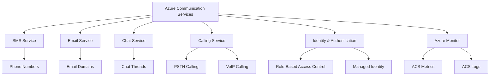

---
content_sources:
  - https://learn.microsoft.com/azure/communication-services/overview
content_validation:
  status: pending_review
  last_reviewed: null
  reviewer: agent
  core_claims: []
---

# Core Knowledge Graph for ACS

The Core Knowledge Graph provides a visual overview of Azure Communication Services (ACS) and how its various components, services, and concepts are interconnected.

<!-- diagram-id: core-knowledge-graph-diagram -->

## Interactive Knowledge Graph

The following section will host an interactive Cytoscape graph for a more granular and clickable exploration of the ACS knowledge base.

  <!-- Placeholder for interactive Cytoscape graph div -->

## See Also
- [Azure Communication Services Overview](https://learn.microsoft.com/azure/communication-services/overview)
- [How to: Create and manage Communication Services resources](https://learn.microsoft.com/azure/communication-services/quickstarts/create-communication-resource)

## Sources
- [ACS Documentation](https://learn.microsoft.com/azure/communication-services/)
