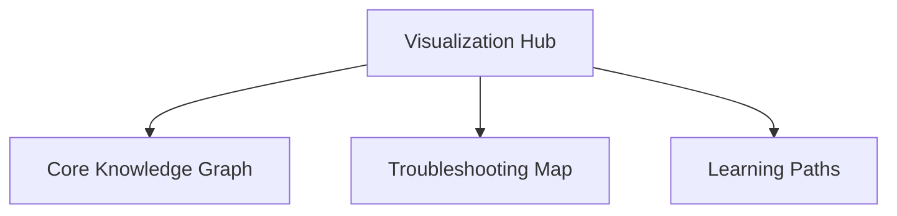

# Visualization Hub

The Visualization section provides interactive and visual representations of Azure Communication Services (ACS) knowledge, troubleshooting, and learning paths.

<!-- diagram-id: visualization-hub -->

## Visualization Documentation

| Document | Description |
| --- | --- |
| [Core Knowledge Graph](core-knowledge-graph.md) | Visual representation of ACS concepts and their relationships. |
| [Troubleshooting Map](troubleshooting-map.md) | Visual decision tree for diagnosing ACS communication issues. |
| [Learning Paths](learning-paths.md) | Visual learning journeys tailored for different user roles. |

## See Also
- [Azure Communication Services Overview](https://learn.microsoft.com/azure/communication-services/overview)

## Sources
- [ACS Documentation](https://learn.microsoft.com/azure/communication-services/)
