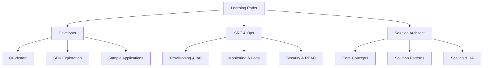

# Learning Paths for ACS Roles

Customized learning journeys to help different user roles master Azure Communication Services (ACS).

<!-- diagram-id: learning-paths-diagram -->

## Developer Learning Path

For developers focused on building applications with ACS:

1. **Quickstart**: Create an ACS resource and send a test message.
2. **SDK Basics**: Learn how to use the SDKs for SMS, Email, and Chat.
3. **Advanced Integration**: Integrate Calling and Call Automation into your apps.

## SRE and Operations Learning Path

For professionals managing ACS infrastructure:

1. **Infrastructure as Code**: Master Bicep and Terraform for ACS deployment.
2. **Monitoring**: Set up Azure Monitor metrics and Log Analytics.
3. **Security**: Implement RBAC, Managed Identity, and key rotation.

## Solution Architect Learning Path

For architects designing communication solutions:

1. **Architecture Patterns**: Explore common communication architectures.
2. **Scale and High Availability**: Design for regional failover and peak loads.
3. **Compliance and Governance**: Ensure your communication solution meets regulatory requirements.

## See Also
- [Azure Communication Services Overview](https://learn.microsoft.com/azure/communication-services/overview)
- [How to: Create and manage Communication Services resources](https://learn.microsoft.com/azure/communication-services/quickstarts/create-communication-resource)

## Sources
- [ACS Documentation](https://learn.microsoft.com/azure/communication-services/)
