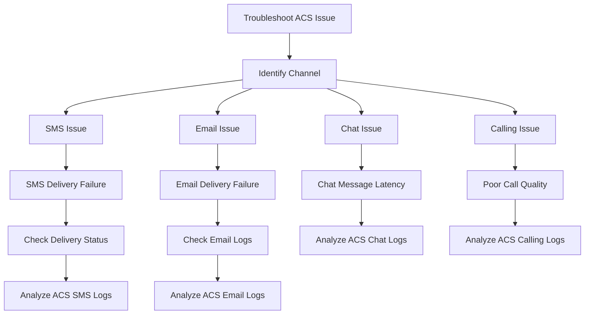

# Troubleshooting Map for ACS

The Troubleshooting Map is a visual decision tree to help you diagnose and resolve common communication issues in Azure Communication Services (ACS).

<!-- diagram-id: troubleshooting-map-diagram -->

## Interactive Troubleshooting Map

The following section will host an interactive troubleshooting map for a step-by-step diagnostic journey.

  <!-- Placeholder for interactive troubleshooting map div -->

## See Also
- [Log Analytics and Kusto queries](https://learn.microsoft.com/azure/azure-monitor/logs/log-analytics-tutorial)
- [How to: Use KQL for ACS troubleshooting](https://learn.microsoft.com/azure/communication-services/concepts/logging-and-diagnostics)

## Sources
- [ACS Documentation](https://learn.microsoft.com/azure/communication-services/)
